# AI Productivity: Does AI Help or Hurt the Business?

**Team Members**: Alexandra Tabarani · Edoardo Cocciò · Gabriele Loreti

```
├── main.ipynb                          # Main notebook: EDA + Modelling
├── scripts/
│   └── preprocess.py                   # Data loading and cleaning pipeline
├── data/
│   └── ai_productivity_dataset_final.csv
├── images/                             # All charts generated by the notebook
├── pyproject.toml
└── uv.lock
```

```bash
uv sync
uv run jupyter notebook main.ipynb
```

---

## Section 1. Introduction

Generative AI tools promise to make knowledge workers faster. But faster does not always mean more profitable. When a consultant uses AI to draft a report in two hours instead of six, who captures the gain: the agency, or the client? Does the time saved translate into higher margins, or does it get absorbed by rework, lower billing rates, or pricing models that were never designed for AI-assisted delivery?

This project investigates those questions empirically. Using a dataset of 3,248 professional service tasks, we analyse the relationship between AI usage and financial outcomes: profit, loss rate, and SLA performance and identify the conditions under which AI assistance helps or hurts. The analysis moves through three stages: exploratory data analysis, baseline statistical modelling, and machine learning with a focus on interpretability techniques.

The primary research question is:

> **At what level of AI usage does AI assistance start compressing profit margins, and what moderating factors explain when AI helps versus hurts?**

Secondary questions include:

* Does AI usage reduce SLA breach rates or introduce new delivery risk?
* Does higher AI usage reduce perceived quality (outcome scores)?
* How does the pricing model (fixed, hourly, value-based) mediate the relationship between AI and profit?
* Do senior contributors extract more or less value from AI than junior ones?
* Do scope changes compound or dampen the effect of AI on rework and cost?

---

## Section 2. Methods

The unit of analysis is a single professional service task. The raw dataset contains **3,248 tasks** spanning content, design, SEO, and media delivery teams. Each row records pre-task observables (client tier, team, task type, seniority, complexity, brief quality, deadline pressure, scope change flag, pricing model, SLA), execution metrics (hours_spent, billable_hours, ai_usage_pct, revisions, errors, rework_hours), and post-delivery outcomes (outcome_score, revenue, cost, profit, SLA breach). The full schema:

| Column | Type | Description |
|---|---|---|
| `task_id` | string | Unique task identifier |
| `client` | string | Client name |
| `project_id` | string | Project identifier |
| `client_tier` | categorical | Client tier classification |
| `team` | categorical | Delivery team (Content, Media, SEO, Design) |
| `task_type` | categorical | Task category (article, design, ticket, report, ad, dev, release) |
| `seniority` | categorical | Contributor seniority (junior, mid, senior) |
| `task_complexity_score` | numeric | Internal complexity rating |
| `brief_quality_score` | numeric | Quality score of the task brief |
| `deadline_pressure` | numeric | Measure of deadline urgency |
| `scope_change_flag` | binary | 1 if the task scope changed after kick-off |
| `pricing_model` | categorical | Pricing structure (fixed, hourly, value_based) |
| `created_at` | datetime | Task creation timestamp |
| `delivered_at` | datetime | Task delivery timestamp |
| `sla_days` | numeric | Number of days allowed by the SLA |
| `sla_breach` | binary | 1 if SLA was breached, 0 otherwise |
| `hours_spent` | numeric | Total hours spent on the task |
| `billable_hours` | numeric | Hours billed to the client |
| `ai_usage_pct` | numeric | Share of work performed with AI assistance (0–100%) |
| `ai_assisted` | boolean | Redundant binary flag; dropped in favour of `ai_usage_pct` |
| `revisions` | numeric | Number of revisions requested |
| `errors` | numeric | Count of errors recorded during delivery |
| `rework_hours` | numeric | Hours spent on rework |
| `outcome_score` | numeric | Internal quality / outcome assessment (0–100) |
| `revenue` | numeric | Revenue billed for the task (€) |
| `cost` | numeric | Cost of delivery (€) |
| `profit` | numeric | Revenue minus cost (€); can be negative |
| `task_status` | categorical | Current task status |
| `workflow_stage` | categorical | Stage in the delivery workflow |

Key statistical properties of the variables shape several methodological choices:

| Variable | Notable Stats |
|---|---|
| `profit` | Median ~€254; ranges from −€8,510 to large positive values; 25% of tasks are loss-making |
| `revenue` | Median ~€966 |
| `ai_usage_pct` | Main predictor; 144 missing values (4.4%); excluded from regression rather than imputed |
| `hours_spent` | Median 11.1 h; peaks at 263.6 h (23× the median, extreme right tail) |
| `rework_hours` | Median 1.8 h; peaks at 57.5 h |
| `outcome_score` | Flat across AI usage bands (~69 on average) |

Severe right-skewness in `hours_spent` and `profit` motivates the use of HC3 heteroskedasticity-robust standard errors in the linear models and tree-based learners that do not require distributional assumptions. The 25% loss rate motivates a parallel binary classification target `is_loss = (profit < 0)` alongside the continuous regression target.

The raw data contained impossible values, categorical inconsistencies, duplicate records, and logical date errors. Each issue was inspected individually, its root cause was reasoned through, and a resolution was applied. The guiding principle was to remove only what was genuinely uninterpretable while preserving every row that carries legitimate business signal, including unprofitable tasks and future-dated scheduled work. The dataset settled at **3,016 rows** after cleaning. The specific operations:

* Seventeen rows had **negative `billable_hours`** ranging from −0.28 h to −1.90 h. Twelve remained profitable and five were loss-making. Values were capped at zero; no rows removed.
* 817 tasks (25%) recorded **negative `profit`**. Unlike negative billable hours, negative profit is a valid and highly informative business outcome. These rows were kept, and a binary column `is_loss` was added as a classification target.
* Sixty-seven rows where **`rework_hours` > `hours_spent`** violated a logical constraint with no plausible business explanation, and were treated as data entry errors and dropped.
* Rows showing **`ai_assisted` vs `ai_usage_pct` in direct contradiction** prompted dropping `ai_assisted` in favour of the strictly more informative continuous measure throughout the analysis.
* The raw `team` column recorded 15 distinct values (casing variants and typos) that mapped to 4 real teams. The raw `task_type` column recorded 29 distinct values (typos, aliased names, spurious suffixes) that mapped to 7 real types. Both columns were standardised.
* 45 `task_id` values appeared **twice**. The most recent record per task (by `updated_at`) was kept.
* Eleven rows with `delivered_at` earlier than `created_at` were removed. 505 future-dated tasks were retained as legitimately scheduled work.

The analytical pipeline proceeds in three escalating stages, each justified by the limits of the previous one. First, a descriptive exploratory analysis maps the empirical relationship between AI usage and outcomes across the full distribution, using a shared three-level categorical variable `ai_band` derived from `ai_usage_pct` (**low** 0–25%, **medium** 25–50%, **high** above 50%) and a finer decile cut where higher resolution is needed. Second, a fully interpretable OLS baseline regression with HC3 robust errors quantifies the marginal euro contribution of each pre-task observable, then layers AI × pricing_model and AI × seniority interactions plus a rework quadratic term to test the mechanism by which AI affects profit. Third, regularised linear models (cross-validated LASSO, Ridge) confirm that variable selection is robust to parametric assumptions, and Random Forest plus XGBoost capture non-linearities and interaction effects without manual specification. SHAP values reconstruct directional drivers from the tree-based models and locate the AI-usage threshold at which the marginal effect on profit changes sign.

The two-stage choice (OLS first, ML second) is deliberate: a tree-based model that fits well but cannot answer "how many euros does AI add holding everything else fixed" leaves the causal question unanswered, while a linear model alone misses the threshold and interaction structure that the EDA already suggests. SHAP over classical feature importance is preferred because RF importance is biased toward high-cardinality features and gives no direction; SHAP gives per-task signed contributions that align with the OLS narrative. All models share the same 80/20 train-test split.

The figure below illustrates the end-to-end pipeline used to produce every result in this report:

```
Raw CSV (3,248 rows)
        │
        ▼
[scripts/preprocess.py] ── normalise teams/task types, drop logical
        │                  errors, cap negative billables, deduplicate
        ▼
Cleaned dataset (3,016 rows) ── ai_band derived, is_loss target added
        │
        ├──────────────► EDA: decile means, band violins, heatmaps,
        │                tipping-point dashboard (figures saved to /images)
        │
        ├──────────────► OLS (HC3) ── interaction model ── LASSO / Ridge
        │
        └──────────────► Random Forest / XGBoost
                             │
                             ▼
                         SHAP: beeswarm, dependence plots, waterfall,
                         pre-task risk checklist
```

The project uses `uv` for dependency management. Reproducing the environment requires:

```bash
uv sync
uv run jupyter notebook main.ipynb
```

The full dependency tree (with pinned versions) is captured in `pyproject.toml` and `uv.lock`. The core scientific stack is `pandas`, `numpy`, `scikit-learn`, `statsmodels`, `xgboost`, `shap`, `matplotlib`, `seaborn`, and `jupyter`.

---

## Section 3. Experimental Design

Six experiments validate the contributions of this project. Each is described by its main purpose, the baseline used for comparison, and the evaluation metrics chosen.

**Experiment 1: Decile-level descriptive analysis of AI usage and outcomes.** The main purpose is to map the empirical relationship between AI intensity and core outcomes (profit, hours, rework, errors, outcome score, SLA breach, loss rate) across the full usage spectrum, before imposing any model assumption. The baseline is the lowest decile (manual baseline, 0–10% AI usage); metrics are also indexed to this baseline (= 100) for the speed–quality trade-off chart. The evaluation metrics are mean profit per task, mean hours_spent, mean rework_hours, mean errors, SLA breach rate, loss rate, and mean outcome_score, all reported by decile and by AI band, because these are the operational quantities the agency reports internally.

**Experiment 2: OLS baseline regression on `profit`.** The main purpose is to quantify the marginal euro contribution of each pre-task observable to profit, holding everything else fixed: a question tree-based models cannot answer directly. The baseline of comparison is a null model with no predictors; the intercept anchors the coefficient interpretation. The evaluation metrics are coefficient magnitudes, p-values with HC3 heteroskedasticity-robust standard errors (chosen because of the right-skewed nature of `profit` and `hours_spent`), and R² as goodness-of-fit, with a statistical significance threshold of p < 0.05.

**Experiment 3: Interaction mechanism test.** The main purpose is to test the causal architecture beneath the baseline by adding AI × pricing_model and AI × seniority interactions, plus a rework quadratic term and AI × rework interaction. The baseline is the OLS specification from Experiment 2 without interactions, with junior seniority and the fixed pricing model as reference categories. The evaluation metrics are interaction coefficient magnitudes, p-values, and the sign and magnitude of the net AI effect under each contract type and seniority level.

**Experiment 4: Regularised linear models (LASSO and Ridge).** The main purpose is to verify that variable selection from OLS is not an artefact of parametric assumptions, and to check for overfitting or collinearity distortion. The baseline is the OLS coefficients and R² from Experiment 2. The evaluation metrics are the number of features zeroed by cross-validated LASSO, Ridge R², and the comparison of which variables survive each procedure against OLS significance.

**Experiment 5: Random Forest and XGBoost (regression on `profit`, classification on `is_loss`).** The main purpose is to capture non-linearities and interaction effects without manual specification, and to benchmark the ceiling of predictive performance for both targets. The baselines are OLS R² for the regression task and the majority-class baseline (loss rate ≈ 24%) for the classification task. The evaluation metrics are R² on the held-out test set and MAE for the regression, and ROC-AUC plus recall and precision on the loss class for the classifier (recall is prioritised because the operational use case is flagging risky tasks before delivery, where missed losses are costlier than false alarms).

**Experiment 6: SHAP interpretability of the tree-based models.** The main purpose is to reconstruct directional drivers and detect threshold effects in the AI-usage variable that linear models cannot represent, and to confirm consistency with the OLS narrative. The baseline is the OLS coefficient signs and magnitudes from Experiments 2 and 3, used as the reference for directional consistency. The evaluation metrics are mean absolute SHAP value for driver ranking, the SHAP value sign-change point on `ai_usage_pct`, mean SHAP per zone, and dependence-plot interactions across pricing_model, seniority, and hours_spent.

---

## Section 4. Results

The descriptive analysis surfaces the empirical regularities that drive every subsequent finding. Distributions of core variables show that **hours_spent** and **profit** exhibit severe right-skewness: hours_spent (skew 10.18) shows a massive disconnect between the 11.16-hour median and very long tasks exceeding 250 hours, while profit reveals losses exceeding €8,000. **rework_hours** and **errors** follow the same right-skewed pattern. In contrast, **ai_usage_pct** shows a broad, healthy distribution across the 0–80% range. The **outcome_score** is the only near-symmetric variable (skew −0.29), suggesting the true narrative lies in the volatile tails of efficiency and cost rather than in shifting mean quality.

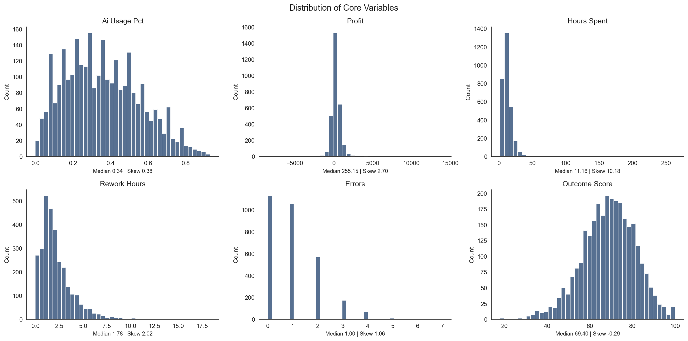

Decile means against AI usage reveal that **profit** nearly doubles, climbing from approximately €257 in the lowest decile to a peak of €513, while **hours_spent** drops toward 11 hours per task. This speed-up coincides with a steady rise in **rework_hours** and **errors**, suggesting high-intensity AI adoption trades accuracy for velocity. The **outcome_score** remains remarkably flat for the majority of the distribution before exhibiting a visible decline after the 60–70% decile midpoints, signalling a potential diminishing-returns threshold.

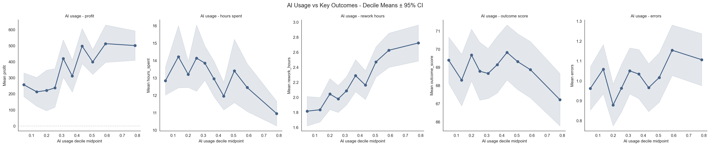

By AI band, higher integration correlates with superior financial and delivery performance, though not without secondary operational costs. SLA breaches drop from 44.3% to 31.9% and loss rates fall from 31.3% to 19.7% as AI usage increases. However, both **mean errors** and **mean revisions** trend upward alongside a higher-reaching distribution in **rework_hours**: the delivery process becomes more iterative. The **outcome_score** median holds steady near 70 across all bands, confirming AI is primarily optimising *how* work is produced, not *what* is delivered.

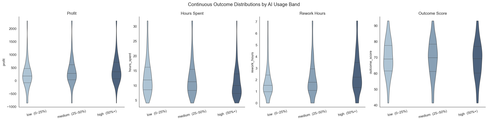
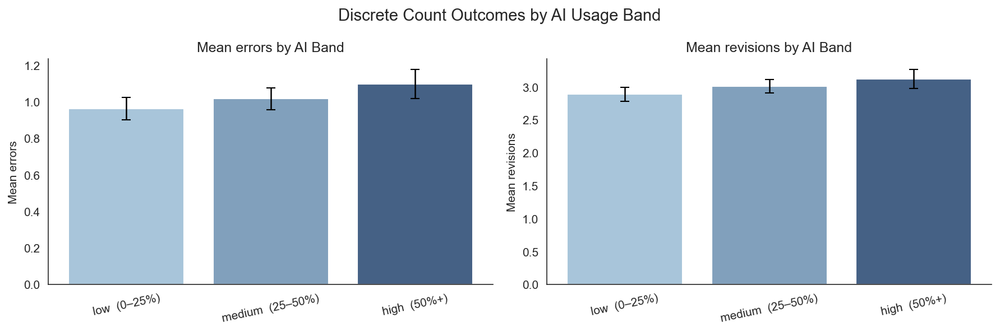
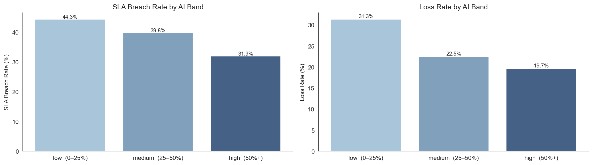

Indexed to the low AI band (= 100), hours fall to roughly 85 of baseline (saving ~2 hours per task), rework rises to ~137 of baseline (adding ~0.7 hours), and outcome score stays between 98 and 101 throughout. The net efficiency gain is approximately 1.3 hours per task.

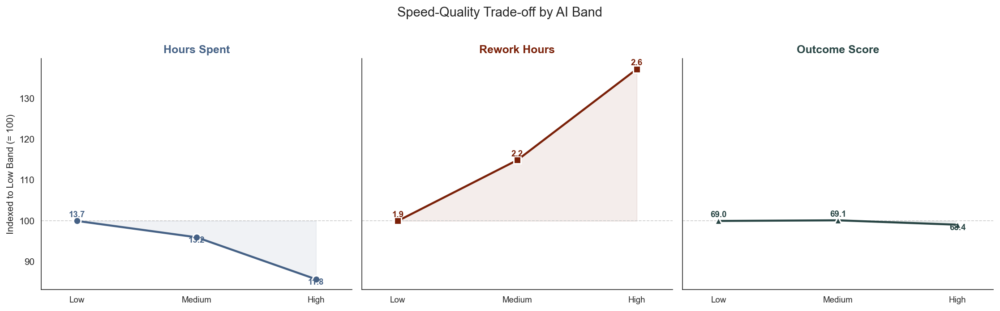

Not all task types respond to AI equally. **Release** tasks show the strongest and most statistically reliable AI dividend, with profit rising significantly across bands (p = 0.018). **Article** and **ad** tasks exhibit an inverted-U pattern: peaking in the medium band and falling at high AI usage, suggesting that over-automation in content-heavy work introduces enough rework to erode initial gains. At the team level, **SEO** captures the largest absolute benefit, while the **Content** team experiences a distinct profit decrease at the highest AI usage levels.

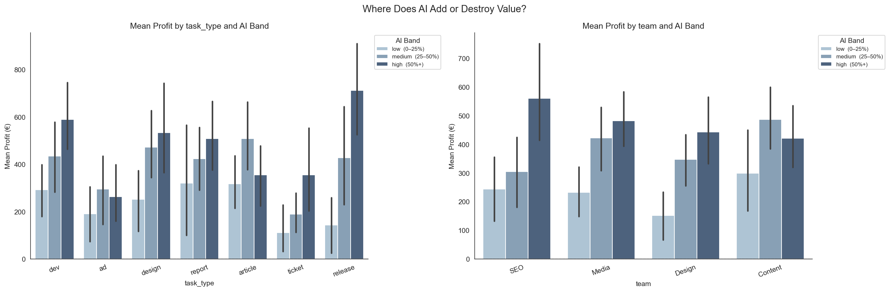

Junior contributors reach a performance ceiling in the medium AI band (€569) and see profits decrease at high usage (€521). Senior contributors achieve their highest profit at high AI usage, but carry much higher financial risk when tasks fail due to their expensive billing rates. Task complexity shows a definitive sweet spot for AI integration in the middle of the scale: high AI usage is not beneficial for the simplest tasks (score 1) or the most difficult tasks (score 5), where profit dips compared to the medium band. Deadline pressure acts as a major catalyst for AI-driven profitability, with margins scaling consistently as usage increases across all pressure levels.

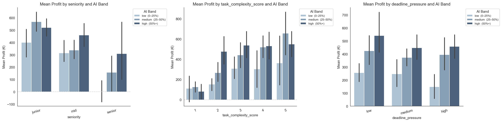

Crossing seniority with pricing model produces the most striking finding: senior contributors on hourly contracts record the worst mean profit of any segment, a negative mean of **−€77**. Senior profitability improves on fixed contracts and reaches its peak on value-based models at **€511**. On hourly contracts, every hour saved by AI is an hour not billed, causing efficiency gains to vanish from the revenue line. On fixed or value-based contracts, those saved hours become margin. Junior contributors on value-based contracts are the most profitable profile in the matrix at **€923** per task: their lower cost base maximises the spread between the fixed fee and the reduced hours spent.

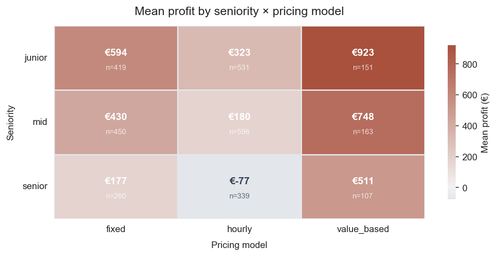

The correlation heatmap shows that **ai_usage_pct** acts as a driver for both financial gain and process friction: higher AI integration correlates with improved profit (0.11) and reduced sla_breach (−0.11), but simultaneously with increased rework_hours (0.17). **brief_quality_score** emerges as a critical safeguard: it is the strongest positive predictor of outcome_score (0.34) and negatively associated with rework_hours (−0.36).

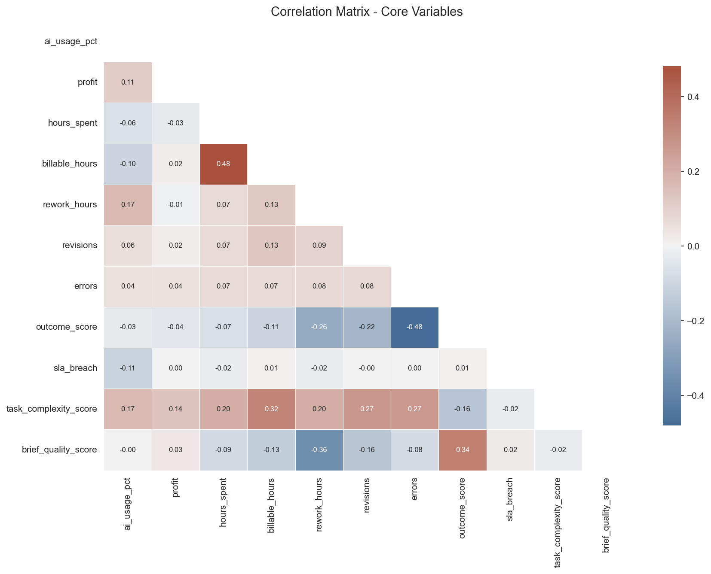

High AI usage acts as a critical stabiliser against scope creep. While scope changes typically erode margins and increase deadline risk in low-automation workflows, the **high (50%+)** AI band shows a reversal: tasks with expanded scopes achieve the highest overall profitability and a significantly lower SLA Breach Rate. Rework hours remain consistently elevated, confirming that while AI protects the bottom line, it still requires iterative corrections to navigate changing requirements.

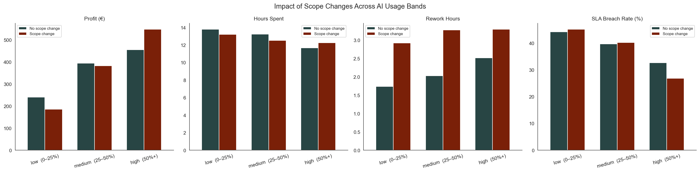

A definitive productivity threshold appears around the **50–60%** AI usage mark, where a consistent decline in hours spent begins to outweigh the rising rework tax. The data also reveals a significant drop in sample size at the highest automation levels: only **3 tasks** in the 90–100% band vs. over 500 in the 20–30% band. The most reliable efficiency gains are currently captured in the **60–80%** range. AI integration only becomes a net positive after passing this threshold: in the **10–60%** range AI usage is actually counterproductive, with rising rework producing a consistent net loss of time. A break-even point occurs at the **60–70%** mark, after which speed gains outpace the rework tax and net hours trend sharply downward.

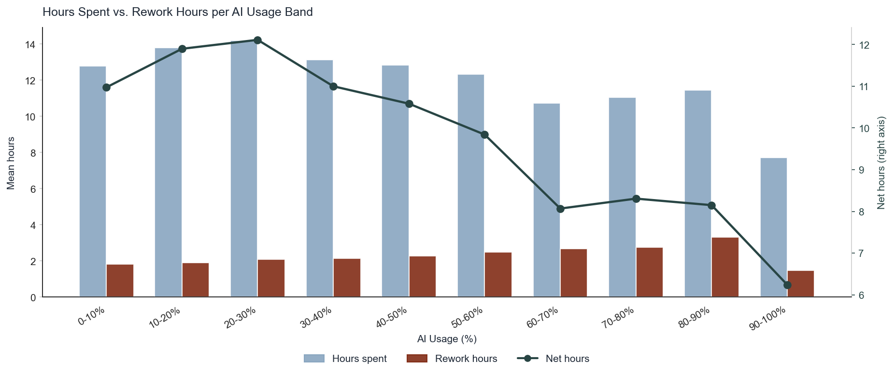
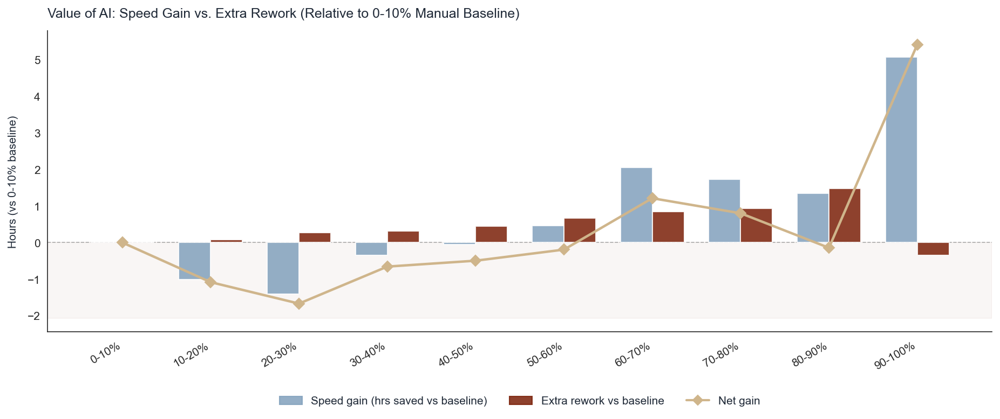

Hourly billing acts as a financial bottleneck: under hourly contracts, every hour saved by AI directly reduces billable revenue, transferring the productivity gain to the client. Value-based pricing consistently delivers the highest profit margins by decoupling earnings from labour time. Fixed-fee models show a dramatic breakout at the highest automation levels, where near-zero labour costs transform the bulk of the contract value into margin. Hourly contracts consistently yield the highest risk of loss, peaking near **38%**. As AI integration increases across all three models, there is a nearly universal decrease in the loss rate; by the 70–90% range, the risk for value-based and fixed models plummets toward zero.

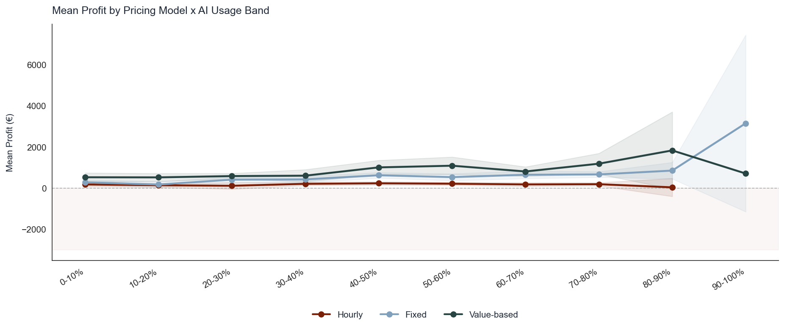
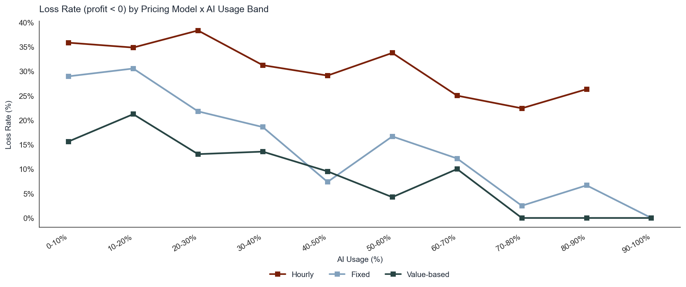

Between **10% and 30%** AI usage, mean hours spent peak at **14.2 hours**: shallow adoption adds more overhead in experimentation and oversight than it saves in execution. A definitive efficiency pivot occurs once the **50% threshold** is crossed, with hours trending downward and stabilising in the 60–80% zone. The average outcome score remains resilient at approximately **70%** across all AI bands, with a slight quality dip and increased volatility in the **70–90%** stress zone, where the 10th percentile hits its lowest point. A rising rework ratio directly correlates with a sharp decline in financial risk: the loss rate drops from over **30%** to a mere **15%** in the high-intensity bands, even as rework peaks at roughly **32%**. The critical intersection between **50% and 60%** usage marks the pivot point where the business moves from a high-loss environment to a high-rework, low-risk model.

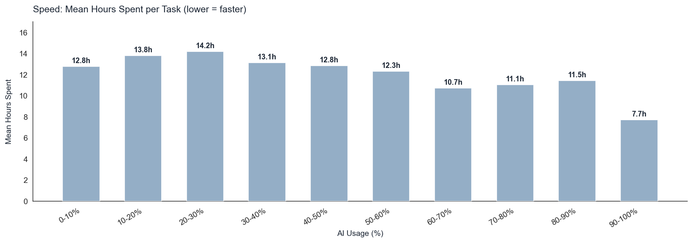
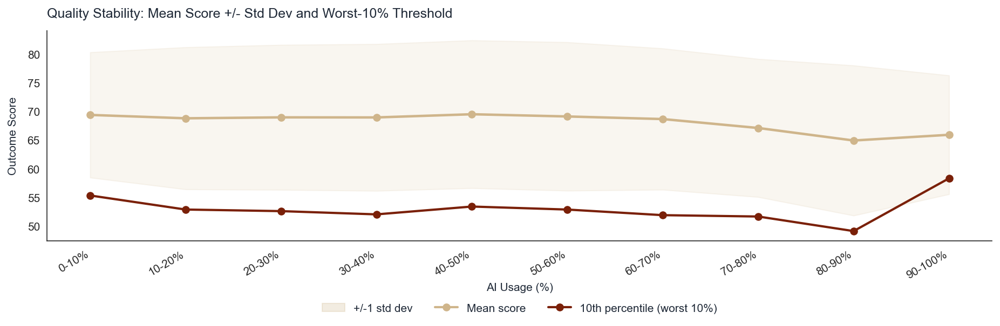
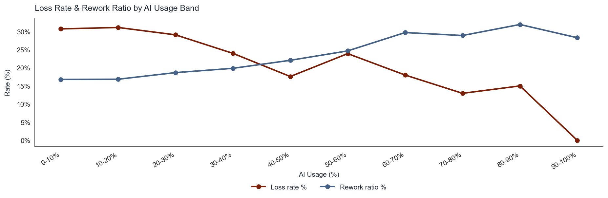

A single dashboard normalises five metrics to zero at the manual baseline (0–10% AI): mean profit, mean hours, mean outcome score, rework ratio, and loss rate, with sign-adjustment so upward movement always represents improvement. The transition from operational degradation to business improvement occurs only after crossing the **50% usage threshold**. Beyond this point, profit improves sharply, reaching about **+139%** versus the 0–10% baseline in the 80–90% band, while quality score remains stable.

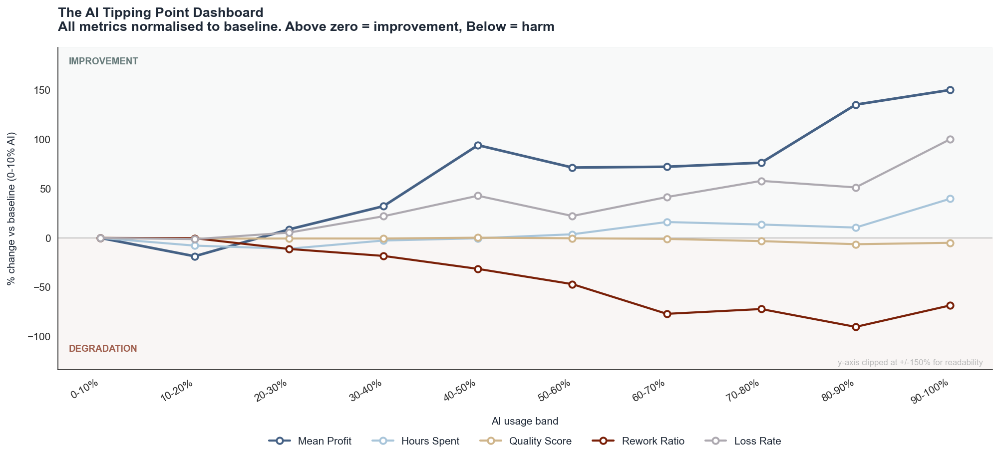

Three heatmaps cross seniority (junior, mid, senior) against AI usage in five bands, colour-coding mean profit, loss rate, and mean rework hours respectively. While seniors face the highest financial risk at low AI usage (**51% loss rate**), pushing into the 80–100% band unlocks **€3,935 mean profit per task** far outpacing any other group. Juniors provide the most consistent baseline safety across all bands thanks to their lower cost structure. Mid-level contributors are the most stable operators, showing consistent profit growth and reliable safety profiles across all bands.

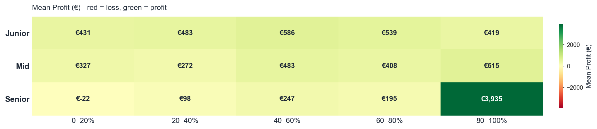
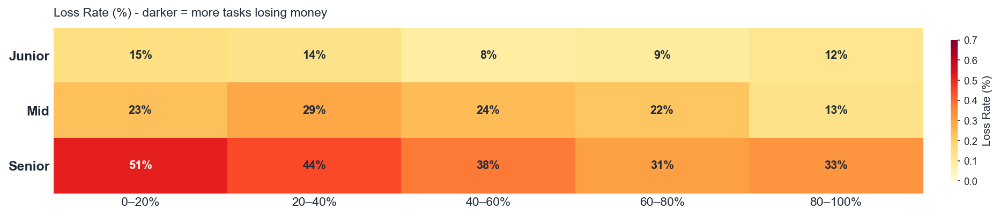
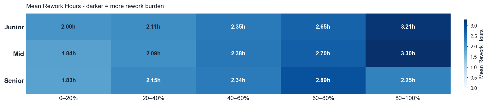

By task type, **Release** tasks see the most dramatic transformation: mean profit from **€138** to **€816** (nearly 6×). **Dev** tasks more than double, while **Report** rises by about 62%. **Article** is the only category where high AI usage *reduces* profit, due to the heavy rework tax required to bring automated creative writing up to standard.

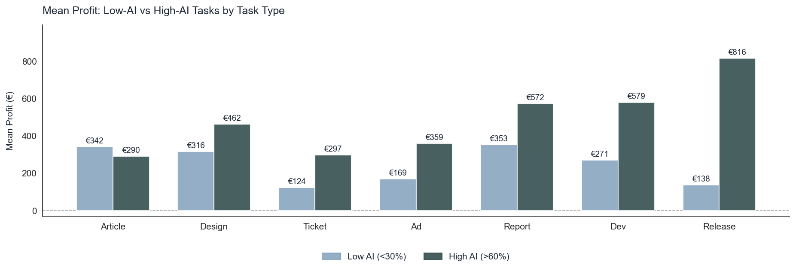

The rework cascade shows that as usage climbs into the 80–90% range, rework hours surge by over **80%**, marking the peak stress point for the team. At the extreme 90–100% level, errors skyrocket while rework hours fall, a potential Safety Net Failure where contributors stop checking AI output. Given the tiny sample size in that band, this is a directional warning rather than a definitive conclusion.

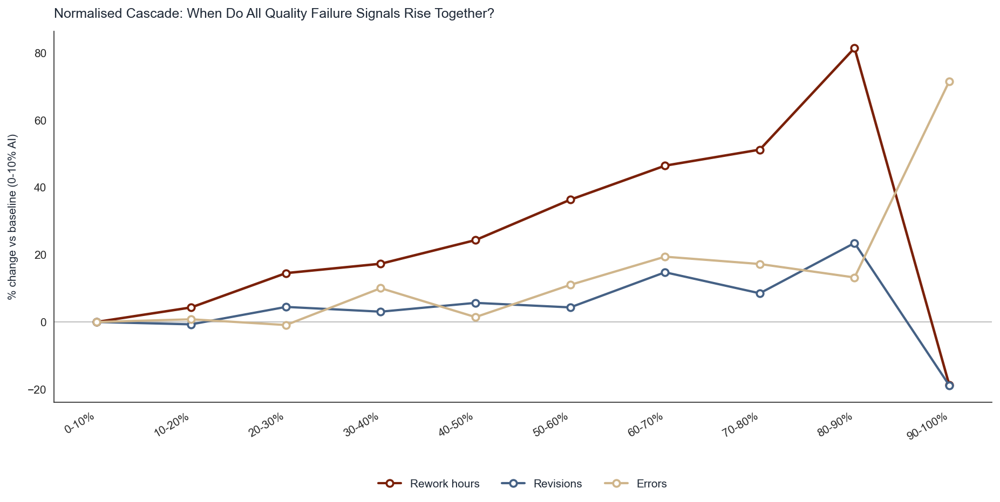

High-quality briefs (Q3 and Q4) consistently secure the best mean outcome scores (71–74) regardless of AI usage, effectively setting a performance floor that AI band cannot shift. AI acts as a financial accelerator for lower-tier briefs: the Mid-Low (Q2) category at high AI usage yields a maximum profit of €571 despite mediocre qualitative scores. The rework tax is not primarily an AI problem; it is a brief problem that AI amplifies by generating output faster than a poor brief can constrain it.

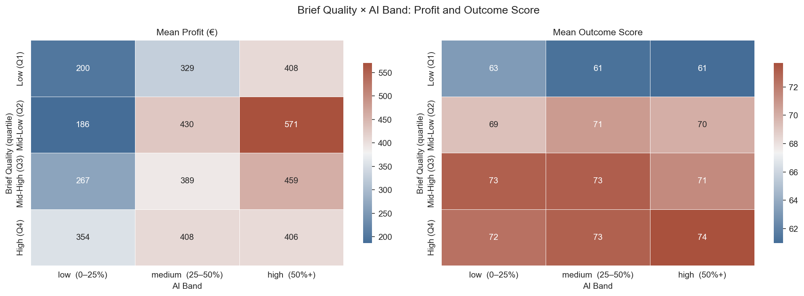

Moving to the inferential models, the OLS baseline gives a direct causal read of each coefficient:

| Variable | Coefficient | p-value |
|---|---|---|
| `ai_usage_pct` | **+€222** | 0.015 |
| `pricing_value_based` | **+€286** | < 0.001 |
| `pricing_hourly` | **−€254** | < 0.001 |
| `seniority` | **−€173** | < 0.001 |
| `task_complexity_score` | **+€111** | < 0.001 |
| `client_tier` | **+€114** | < 0.001 |
| `hours_spent` | **−€5** | 0.034 |

R² = 0.115. The key structural result: once `hours_spent` enters the model, every quality variable (`errors`, `revisions`, `rework_hours`, `outcome_score`) loses statistical significance entirely. **AI's profit effect runs entirely through hours, not quality.** The contract structure then decides whether those saved hours accrue to the agency or the client.

The interaction model exposes the causal architecture beneath the baseline. For pricing:

| Interaction | Coefficient | p-value |
|---|---|---|
| AI × hourly | **−€701** | < 0.001 |
| AI × value_based | +€247 | 0.398 (n.s.) |

In the interaction specification the reference AI main effect is about −€201 and the AI × hourly interaction is −€701, so the net AI effect under hourly pricing is approximately **−€902 per task**. AI compresses hours, fewer hours are billed, revenue falls while costs do not, and the productivity dividend transfers to the client. There is no usage threshold that makes hourly billing safe under AI. For seniority:

| Interaction | Coefficient | p-value |
|---|---|---|
| AI × seniority | **+€359 per level** | 0.002 |

Each seniority level raises the marginal return of AI by €359. At senior level (two steps above junior), the interaction gain (€718) fully reverses and more than doubles the baseline cost drag (€346). Seniors are commercially unviable under manual work; they are the highest-value configuration under high AI. Both additional mechanism tests were non-significant: rework quadratic term (p = 0.605) and AI × rework interaction (p = 0.801). **AI does not act on profit through quality at all.**

LASSO (cross-validated) zeroed out 12 of 25 features, and every variable zeroed was also non-significant in OLS, confirming that variable selection was not an artefact of parametric assumptions. Ridge (R² = 0.114) is consistent with OLS (R² = 0.115), confirming no overfitting or collinearity distortion in the baseline.

The tree-based models capture the non-linearities the linear specification cannot represent:

| Model | Metric | Value |
|---|---|---|
| RF Regression | R² (test set) | **0.223** |
| RF Regression | MAE | **€375** |
| RF Classifier | ROC-AUC | **0.754** |
| RF Classifier | Recall (loss class) | **0.55** |
| RF Classifier | Precision (loss class) | **0.43** |
| XGBoost Regression | R² (test set) | **0.208** |

Random Forest reaches R² = 0.223 on the held-out test set: a roughly threefold improvement over OLS (0.068) that comes from capturing non-linearities and interaction effects without manual specification. XGBoost and Random Forest agree on R² within 0.015 and share identical top-5 SHAP drivers, confirming the findings are robust to model architecture. The classifier correctly identifies **55% of actual loss-making tasks before delivery** with 43% precision: flagging 100 tasks as risky will correctly identify 43 genuine losses, against a background loss rate of 24%.

`pricing_model_hourly` is the dominant driver of regression predictions (largest mean absolute SHAP value). `seniority` is the top predictor of loss probability in the classifier. Both rankings are consistent across RF and XGBoost. The dual beeswarm confirms the direction of each driver across both tasks.

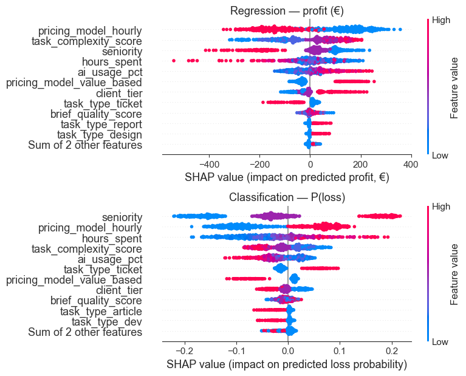

In the **regression** (top panel), high `pricing_model_hourly` (red) is the single largest drag on predicted profit. High `task_complexity_score` and `pricing_model_value_based` push right (help profit). `ai_usage_pct` shows a wide, sign-switching spread consistent with the threshold effect below. In the **classification** (bottom panel), high `seniority` (red) is the dominant predictor of loss probability, followed by `pricing_model_hourly` and `hours_spent`. High `task_complexity_score` and `pricing_model_value_based` protect against loss. The two panels together confirm that the OLS interaction story holds in the non-linear model: contract structure and seniority dominate, AI usage is a secondary but real moderator.

Plotting SHAP values for `ai_usage_pct` against the raw feature value reveals a sign change at **30.6% AI usage**:

| Zone | Tasks in test set | Mean SHAP |
|---|---|---|
| Below 30.6% | 234 / 553 | **−€52.5 per task** |
| Above 30.6% | 319 / 553 | **+€51.1 per task** |

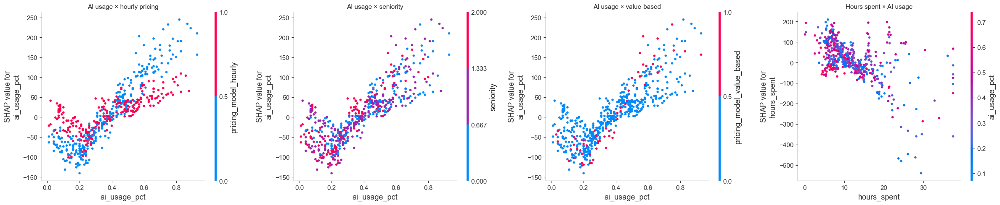

Four dependence plots show how the SHAP contribution of `ai_usage_pct` varies with its raw value, each coloured by an interaction variable. Under **hourly pricing** (first panel), SHAP values remain negative across virtually the entire range; there is no usage level at which AI turns profitable under hourly contracts. Under **seniority** (second panel), senior contributors show the steepest positive SHAP slope at high AI usage, consistent with the OLS interaction of +€359 per seniority level. Under **value-based pricing** (third panel), higher AI usage correlates with positive SHAP values, reinforcing that the productivity dividend is only capturable under outcome-linked contracts. The fourth panel (hours spent × AI usage) confirms that long-hours tasks drag profit at low AI usage but benefit at high usage, consistent with the efficiency threshold.

The waterfall deconstructs the single task with the largest predicted loss in the test set (actual: **−€976**, predicted: **−€613**): a senior contributor on a long task with low AI usage and no value-based contract. Every risk factor the classifier flags is present at once, and the model correctly identifies this as a loss.

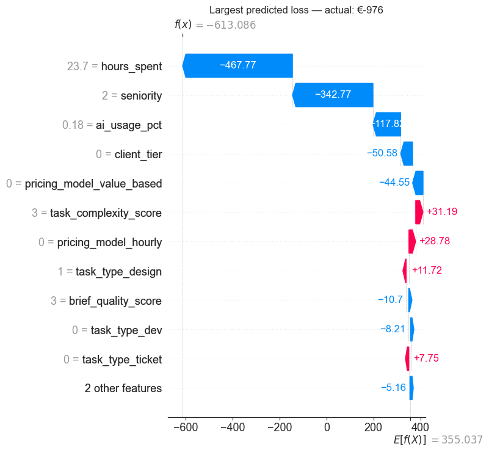

The six variables with the largest impact on loss probability form a practical pre-task risk checklist:

| Variable | Safe bucket | Risky bucket | Gap | Risky share |
|---|---|---|---|---|
| Hourly pricing | 16% | **34%** | +18pp | 46% |
| Seniority (senior) | 21% | **33%** | +12pp | 22% |
| Hours spent (long, top 25%) | 21% | **31%** | +9pp | 25% |
| Client tier (high) | 27% | **16%** | −10pp | 26% |
| Task complexity (high, top 25%) | 26% | **18%** | −8pp | 30% |
| AI usage ≥ 30.6% | 28% | **21%** | −8pp | 58% |

The first three are risk factors (loss rate rises with the variable); the last three are protective (loss rate falls). They compound: a task combining hourly + senior + long hours runs substantially above the 24% baseline, while a task combining high client tier + high complexity + AI above threshold runs materially below it.

Three findings synthesise the analysis. First, mean profit per task rises from **€233 in the low-AI band to €468 in the high-AI band** (+€235 per task), driven not by faster delivery translating into more billable output but by the suppression of worst-case outcomes: loss rate falls from **31.3% to 19.7%** as AI usage increases. The business becomes financially safer by becoming operationally messier, and the relationship is non-linear. Below 50% AI usage, profit gains are modest and barely separable from noise; above 50%, profit improvement accelerates sharply. **The 50% mark is a phase change, not a milestone.** AI saves **~2.0 hours per task** while introducing a **~0.7 hour rework tax**, yielding a **net efficiency gain of 1.3 hours per task**. The friction profile inverts at 60%: above this threshold, rework hours rise faster than execution hours fall, and errors, revisions, and rework move in lockstep.

Second, average outcome score holds at **~69 across all AI bands**, but the **10th percentile of outcome scores drops by about 6 points from the 0–10% band to the 80–90% band**. Quality has bifurcated: most work is fine, the worst work is meaningfully worse. The 90–100% band shows the most concerning pattern, with rework hours falling while error counts rise sharply, the **Safety Net Failure** in which the iterative correction loop that absorbs AI mistakes at moderate usage breaks down at extreme usage. This band contains only **3 tasks** in the cleaned dataset, so the finding is directional, but it justifies a control before the volume scales.

Third, pricing model is the single most consequential variable in the dataset, larger in effect than AI usage itself. On **hourly contracts, AI is a margin destroyer**: loss rates stay around 33% across all AI bands. On **fixed and value-based contracts at high AI usage, profit climbs aggressively and loss rates approach zero**. The gap between the worst pricing model (hourly, €202) and the best (value-based, €1,073) at high AI usage is approximately **€870 per task**, decided entirely at the moment of contract signing. Seniority interacts asymmetrically with this dynamic: **senior contributors at low AI usage carry a 51% loss rate** because their billing rates do not justify manual execution, while the same seniors at **80–100% AI usage deliver a mean profit of €3,935 per task**, roughly 15× the raw dataset median. AI is no longer optional for seniors; it is the only configuration in which their cost base is commercially viable.

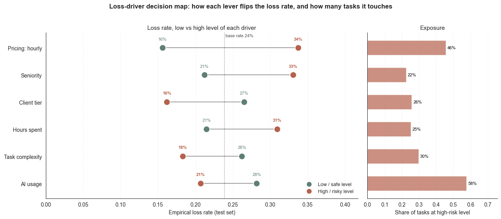

The decision map visualises both the magnitude and the exposure of each lever simultaneously. The left panel shows empirical loss rate on the test set for the safe vs. risky level of each variable, against the 24% base rate; the right panel shows the share of tasks currently sitting at the high-risk level. Pricing is the most damaging and the most prevalent risk factor: 46% of all tasks are on hourly contracts. AI usage at or above 30.6% is the most widely available protective factor, already present in 58% of tasks.

---

## Section 5. Conclusions

The take-away point is that generative AI does help the business, but the gain is concentrated in specific configurations and is largely independent of the headline quality of the output. Mean profit per task rises from €233 to €468 across AI bands, loss rate falls from 31.3% to 19.7%, and a phase change occurs at the 50% AI-usage mark. However, the magnitude of the AI dividend is dwarfed by two structural levers: pricing model (hourly contracts neutralise or reverse the gain entirely; value-based contracts at high AI usage compound it) and seniority (seniors are commercially unviable without AI and the highest-margin configuration with it). The OLS, regularised, and tree-based models converge on the same architecture, and SHAP analysis pinpoints a sign-change threshold at 30.6% AI usage. The strategic implication is simple: AI does not raise the average; it suppresses the floor, and the agency captures the dividend only when the contract permits it.

Several questions are not fully answered by this work because the underlying variables are not tracked in the current data, and they define the natural next steps:

| # | Missing Variable | Why It Matters |
|---|---|---|
| 1 | **Client satisfaction score (NPS/CSAT per deliverable)** | Outcome scores reflect internal quality assessment only. Client-reported satisfaction would reveal whether AI-generated work is accepted, revised, or churned: the retention signal that actually drives long-run revenue. |
| 2 | **AI tool identity** (GPT-4, Claude, Midjourney, Copilot…) | Aggregating all usage into `ai_usage_pct` masks tool-level differences. A task at 80% AI with a code assistant is structurally different from one using an image generator. |
| 3 | **Revision reason codes** (client request / quality failure / scope creep / internal QA) | `rework_hours` exists but not why rework happened. Without this, AI-induced quality failures are indistinguishable from client preference changes. |
| 4 | **Task re-assignment flag** | If a task changes hands mid-delivery, seniority attribution becomes ambiguous: senior contributors may be cleaning up AI-generated work from juniors. |
| 5 | **Actual invoiced amount vs. quoted amount** | Revenue is currently inferred from contract type and hours. Tracking the actual invoice would capture discounting and write-offs that compress margins silently. |
| 6 | **QA / review hours tracked separately from rework** | `rework_hours` conflates first-pass internal review with post-delivery correction. |
| 7 | **AI prompt quality or iteration count** | High `ai_usage_pct` says nothing about how well AI was directed. Two precise prompts vs. thirty rejected iterations yield the same usage share but completely different efficiency profiles. |
| 8 | **Client renewal / churn signal (12-month horizon)** | A task that looks profitable today may have damaged a relationship worth multiples of that single margin. |

The **90–100% AI band contains only 3 tasks** in the cleaned dataset. Deliberately commissioning 30–50 tasks in this band across task types and seniority levels is the single highest-leverage data collection effort available: it would either validate or invalidate the extrapolated trend at extreme automation. Future work should also test whether the 30.6% SHAP threshold and the 50% phase-change boundary generalise outside this single agency, whether the rework-tax inversion replicates with longitudinal client-renewal data, and whether the senior × AI configuration that yields €3,935 mean profit is a stable equilibrium or an artefact of the small high-band sample.
