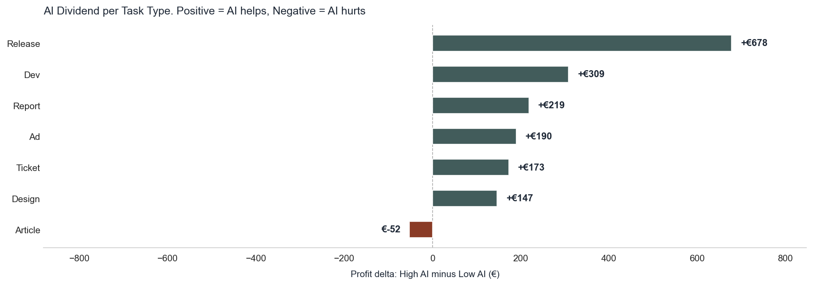
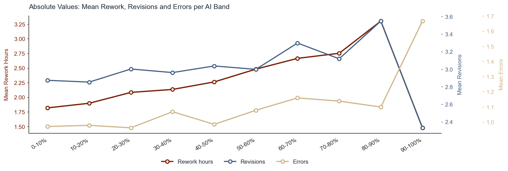

# AI Productivity: Does AI Help or Hurt the Business?

## Introduction

Generative AI tools promise to make knowledge workers faster. But faster does not always mean more profitable. When a consultant uses AI to draft a report in two hours instead of six, who captures the gain: the agency, or the client? Does the time saved translate into higher margins, or does it get absorbed by rework, lower billing rates, or pricing models that were never designed for AI-assisted delivery?

This project investigates those questions empirically. Using a dataset of 3,248 professional service tasks, we analyse the relationship between AI usage and financial outcomes - profit, loss rate, and SLA performance - and identify the conditions under which AI assistance helps or hurts. The analysis moves through three stages: exploratory data analysis, baseline statistical modelling, and machine learning with interpretability techniques.

The central finding is that the effect of AI is not linear and is not uniform. It depends heavily on the pricing model, the seniority of the contributor, and how much of the work is AI-assisted. At high usage levels, profit improves substantially. At intermediate levels, the picture is mixed. The mechanism that most often turns AI into a margin leak is not quality failure: it is a pricing model that lets clients pocket the efficiency gain.

---

## Task Description

The unit of analysis is a single professional service task or deliverable (e.g., an article, a design asset, a development ticket). For each task, the dataset records how much AI was used, how long it took, what it cost, what it billed, and whether the outcome met quality and deadline standards.

The primary research question is:

> **At what level of AI usage does AI assistance start compressing profit margins, and what moderating factors explain when AI helps versus hurts?**

Secondary questions include:

- Does AI usage reduce SLA breach rates or introduce new delivery risk?
- Does higher AI usage reduce perceived quality (outcome scores)?
- How does the pricing model (fixed, hourly, value-based) mediate the relationship between AI and profit?
- Do senior contributors extract more or less value from AI than junior ones?
- Do scope changes compound or dampen the effect of AI on rework and cost?

The analysis is intended to produce actionable findings for business stakeholders, not just statistical significance, but concrete guidance on where AI deployment is profitable and where it is not.

---

## Dataset

The dataset contains **3,248 tasks** drawn from a professional services operation spanning content, design, SEO, and media delivery teams. Each row represents one completed or in-progress task.

### Columns

| Column | Type | Description |
|---|---|---|
| `task_id` | string | Unique task identifier |
| `client` | string | Client name |
| `project_id` | string | Project identifier |
| `client_tier` | categorical | Client tier classification |
| `team` | categorical | Delivery team (Content, Media, SEO, Design) |
| `task_type` | categorical | Task category (article, design, ticket, report, ad, dev, release) |
| `seniority` | categorical | Contributor seniority (junior, mid, senior) |
| `task_complexity_score` | numeric | Internal complexity rating |
| `brief_quality_score` | numeric | Quality score of the task brief |
| `deadline_pressure` | numeric | Measure of deadline urgency |
| `scope_change_flag` | binary | 1 if the task scope changed after kick-off |
| `pricing_model` | categorical | Pricing structure (fixed, hourly, value_based) |
| `created_at` | datetime | Task creation timestamp |
| `delivered_at` | datetime | Task delivery timestamp |
| `sla_days` | numeric | Number of days allowed by the SLA |
| `sla_breach` | binary | 1 if SLA was breached, 0 otherwise |
| `hours_spent` | numeric | Total hours spent on the task |
| `billable_hours` | numeric | Hours billed to the client |
| `ai_usage_pct` | numeric | Share of work performed with AI assistance (0–100%) |
| `ai_assisted` | boolean | Redundant binary flag ; dropped in favour of `ai_usage_pct` |
| `revisions` | numeric | Number of revisions requested |
| `errors` | numeric | Count of errors recorded during delivery |
| `rework_hours` | numeric | Hours spent on rework |
| `outcome_score` | numeric | Internal quality / outcome assessment (0–100) |
| `revenue` | numeric | Revenue billed for the task (€) |
| `cost` | numeric | Cost of delivery (€) |
| `profit` | numeric | Revenue minus cost (€); can be negative |
| `created_by` | string | User who created the task record |
| `updated_at` | datetime | Timestamp of last record update |
| `task_status` | categorical | Current task status |
| `workflow_stage` | categorical | Stage in the delivery workflow |
| `jira_ticket` | string | Associated Jira ticket reference |
| `legacy_ai_flag` | boolean | Legacy AI flag (unreliable; 339 "unknown" entries) |
| `content_version` | string | Content version identifier |

### Key Statistics at a Glance

| Variable | Notable Stats |
|---|---|
| `profit` | Median ~€232; ranges from −€8,510 to large positive values; 25% of tasks are loss-making |
| `revenue` | Median ~€966 |
| `ai_usage_pct` | Main predictor; 144 missing values (4.4%); excluded from regression rather than imputed |
| `hours_spent` | Median 11.1 h; peaks at 263.6 h (23× the median, extreme right tail) |
| `rework_hours` | Median 1.8 h; peaks at 57.5 h |
| `sla_breach` | 40% of all tasks breach their SLA |
| `outcome_score` | Flat across AI usage bands (~69 on average) |

The raw dataset ships with several quality issues that must be resolved before any analysis can be trusted. These are described in full in the next section.

---

## Data Quality and Cleaning

The raw data contained impossible values, categorical inconsistencies, duplicate records, and logical date errors. Each issue was inspected individually, its root cause was reasoned through, and a resolution was applied immediately. The goal was to remove only what was genuinely uninterpretable while preserving every row that carries legitimate business signal, including unprofitable tasks and future-dated scheduled work.

The dataset started at **3,248 rows**. After all cleaning steps it settled at **3,016 rows**.

---

### Impossible Values

#### Negative `billable_hours`

Seventeen rows had negative values for `billable_hours`, ranging from −0.28 h to −1.90 h. Negative hours billed are not physically possible. Inspecting the affected rows showed that the tasks remained profitable, which points to billing corrections or inter-project hour transfers rather than data entry errors. Because negative hours carry no meaningful interpretation, the values were capped at zero. No rows were removed.

#### Negative `profit`

Eight hundred and seventeen tasks (25% of the dataset) recorded negative profit, with losses ranging from −€1.60 to −€8,510. Unlike negative billable hours, negative profit is a valid and highly informative business outcome. These are exactly the rows that matter most for understanding when AI fails to generate margin. They were not removed. A binary column `is_loss` was added to make loss status directly usable as a feature or target variable in modelling.

#### `rework_hours` Greater Than `hours_spent`

Since rework is performed within the total time a task takes, `rework_hours` cannot logically exceed `hours_spent`. Sixty-seven rows violated this constraint. No plausible business explanation exists for this pattern, so the rows were treated as data entry errors and dropped.

#### Conflict Between `ai_assisted` and `ai_usage_pct`

The dataset contained two AI usage columns: a boolean `ai_assisted` flag and a continuous `ai_usage_pct` percentage. A number of rows showed the two columns in direct contradiction, with tasks marked as not AI-assisted despite recording non-zero usage percentages, and vice versa. Because `ai_usage_pct` is a continuous measure that directly captures the share of work done with AI, it is strictly more informative than a binary flag. The inconsistencies are consistent with `ai_assisted` being an unreliable derived field rather than a source of truth. The `ai_assisted` column was dropped in favour of `ai_usage_pct` throughout the analysis.

---

### Categorical Normalisation

#### `team`

The raw `team` column recorded 15 distinct values despite the organisation having only 4 real teams: Content, Media, SEO, and Design. The extra values were entirely the result of casing variants and typos. A standardisation mapping was applied and the column collapsed to 4 clean values.

#### `task_type`

The raw `task_type` column recorded 29 distinct values despite the operation having only 7 real task types: article, design, ticket, report, ad, dev, and release. Issues included inconsistent casing, a spurious `_task` suffix on many entries, outright typos (`artcle`, `repport`, `relese`), and aliased names where the same concept appeared under multiple labels (`blog_article` and `blog` both mapped to `article`; `paid_ad` and `ad` collapsed to `ad`; `support_ticket` to `ticket`; `development` and `dev` to `dev`; `creative` to `design`). A consolidation function was applied and the column collapsed to 7 clean values.

#### `legacy_ai_flag`

This column was declared as boolean but contained a third value, `"unknown"`, in 339 rows. The `"unknown"` entries were replaced with `NaN` so they are handled consistently with other missing values rather than masquerading as a meaningful category. The remaining `"true"` and `"false"` strings were converted to proper booleans.

---

### Duplicate Records

Forty-five `task_id` values appeared twice in the dataset, producing 90 rows for 45 tasks. The most plausible explanation is that tasks were updated after initial entry and both versions were exported. The most recent record per `task_id` (determined by `updated_at`) was kept and the older version was dropped.

---

### Date Validation

Delivery timestamps were parsed to datetime and validated against creation timestamps. Eleven rows recorded a `delivered_at` date earlier than `created_at`, which is logically impossible. These rows were removed.

Five hundred and five tasks had a `created_at` date in the future relative to the data export cutoff. These were retained. Their financial and AI usage fields are fully populated, they represent legitimately scheduled work, and removing them would silently discard valid data.

---

## Exploratory Data Analysis

All visualisations use a shared three-level categorical variable `ai_band` derived from `ai_usage_pct`:

* **low** ; 0 to 25% AI usage
* **medium** ; 25 to 50% AI usage
* **high** ; above 50% AI usage

Where finer resolution is needed, the continuous variable is cut into decile bins. A consistent colour palette is applied throughout so that the same AI band always maps to the same colour across all charts.

---

### 1. Distributions of Core Variables

A 2×3 grid of histograms shows the marginal distribution of the six most important variables before any grouping: `ai_usage_pct`, `profit`, `hours_spent`, `rework_hours`, `errors`, and `outcome_score`.

Three patterns stand out immediately. First, `hours_spent` is extremely right-skewed (skewness 10.18), with a handful of tasks consuming over 250 hours against a median of 11.1 hours. This level of skew will distort any regression that treats the variable as-is, and it flags that the dataset contains qualitatively different work. Second, `profit` is wide and bimodal: a large mass of tasks cluster around zero or slightly positive, while a long left tail extends to losses above €8,000. Third, `outcome_score` is the only variable that looks approximately symmetric (skew −0.14, median 69), which anticipates the finding that average quality does not move much with AI usage ; the story is in the tails, not the mean.

---

### 2. AI Usage vs. Outcomes: Decile Means

Five line plots, each showing a mean outcome variable across AI usage deciles with 95% confidence intervals. The five outcomes are `profit`, `hours_spent`, `rework_hours`, `outcome_score`, and `errors`.

Reading left to right across deciles reveals the core tension of the entire project. Profit rises monotonically with AI usage, accelerating above the 50% mark from roughly €225 in the lowest decile to €514 in the highest. Hours fall steadily, confirming a genuine speed gain of around 4 hours per task. However, rework hours trend upward in the upper deciles, eroding some of that gain. Outcome score stays flat throughout, reinforcing the histogram finding. Confidence intervals widen at the extremes because sample sizes are smaller there; the 90–100% band in particular contains very few tasks and its estimates should be treated with caution.

---

### 3. Outcome Distributions by AI Band

A set of violin plots and grouped bar charts comparing the full distribution of `profit`, `hours_spent`, `rework_hours`, and `outcome_score` across the three AI bands, followed by bar charts for the discrete outcomes `errors`, `revisions`, `sla_breach`, and loss rate.

The violin plots show something the decile line chart cannot: the shape of the profit distribution shifts substantially, not just its mean. Mean profit doubles from €232 (low AI) to €474 (high AI), a gain of €242. But the more important change is at the bottom: the low AI band has a heavy loss tail that largely disappears in the high AI band, with the loss rate falling from 31% to 19% and the SLA breach rate from 44% to 33%. AI does not simply pull the profit distribution upward uniformly ; it primarily removes the worst outcomes. Rework hours increase slightly in the high band, but not enough to offset the gains elsewhere.

---

### 4. Speed–Quality Trade-off

Three line plots indexed to the low AI band (set to 100), showing how `hours_spent`, `rework_hours`, and `outcome_score` evolve as AI usage increases. Indexing removes the unit differences and makes the relative magnitudes directly comparable.

The chart makes the trade-off concrete and quantified. Hours fall to roughly 85 of baseline (a saving of about 2 hours per task). Rework rises to roughly 145 of baseline (an addition of about 0.9 hours). The net efficiency gain is therefore approximately 1.1 hours per task. Outcome score stays between 98 and 101 throughout ; effectively flat. The implication is that AI buys real time, costs some rework, and does not change average quality. What the average hides ; that the quality floor erodes in the high AI tail ; is explored in later plots.

---

### 5. Segmentation by Task Type and Team

Two grouped bar charts with 95% confidence intervals. The left panel shows mean profit by `task_type`, grouped by AI band. The right panel shows the same breakdown by `team`.

Not all task types respond to AI equally. Release tasks show the strongest and most statistically reliable AI dividend, with profit rising significantly across bands (p = 0.018). Article tasks show an inverted-U pattern, peaking in the medium band and falling slightly at high AI, suggesting that heavy AI use on content writing introduces rework that erodes the gain. Design and ad tasks show modest increases at high AI, but intervals are wide. Ticket tasks are effectively AI-agnostic, with flat profit across all bands.

Across teams, Content and Media capture the largest absolute benefit from AI. This is consistent with the task type finding, since those teams handle the article and release workloads where the signal is strongest.

---

### 6. Segmentation by Seniority, Complexity, and Deadline Pressure

Three grouped bar charts breaking down mean profit by `seniority`, `task_complexity_score` (binned), and `deadline_pressure` (binned), each grouped by AI band.

The seniority panel is particularly informative. Junior contributors peak in the medium AI band (€568) and fall slightly at high AI (€525), which may reflect a ceiling on how much AI they can direct productively. Mid-level contributors show the most stable and consistent AI benefit across all bands. Senior contributors grow more profitable with AI in aggregate but carry a disproportionately high loss probability when things go wrong ; the cost buffer associated with senior billing rates means that a failed senior task loses more money than a failed junior one, and AI at high usage levels seems to increase that tail risk.

High-complexity tasks benefit less from AI than low-complexity tasks, which is consistent with AI being better at structured, repeatable work than at genuinely novel problems.

---

### 7. Seniority × Pricing Model: Profit Heatmap

A 3×3 heatmap showing mean profit for every combination of `seniority` (junior, mid, senior) and `pricing_model` (fixed, hourly, value-based). Cells are colour-coded on a diverging red-to-green scale centred at zero, with annotations showing the euro value and sample size.

The single most striking cell is senior on hourly contracts, which records the worst mean profit and the highest loss rate of any segment. The same senior contributors on fixed contracts flip to the highest-profit segment in the entire matrix. This is the clearest evidence in the EDA that the pricing model is not a passive backdrop ; it actively determines whether AI-driven productivity gains accrue to the agency or to the client. On hourly contracts, every hour saved by AI is an hour not billed; the efficiency gain disappears entirely from the revenue line. On fixed contracts, the same saved hour becomes margin.

Junior contributors on value-based contracts show the safest profile at high AI usage: low loss rate and stable profit, because the value-based fee does not compress when delivery speeds up.

---

### 8. Correlation Heatmap

A lower-triangle heatmap of pairwise Pearson correlations between the eleven continuous variables most relevant to the analysis: `ai_usage_pct`, `profit`, `hours_spent`, `billable_hours`, `rework_hours`, `revisions`, `errors`, `outcome_score`, `sla_breach`, `task_complexity_score`, and `brief_quality_score`.

The most important observation is how weak the raw correlations involving `ai_usage_pct` are. Its strongest pairwise relationship is with `rework_hours` (r ≈ 0.13) and `profit` (r ≈ 0.11). These near-zero values are not a sign that AI usage is irrelevant ; they are a sign that its effect is heterogeneous and non-linear. The benefit at high usage is real, but it is moderated by pricing model, seniority, and task type in ways that cancel out when the full dataset is averaged together. This is why simple regression on the raw variable understates the effect and why segmentation and interaction terms are necessary.

Two strong correlations are also visible and expected: `billable_hours` and `hours_spent` move together (r ≈ 0.85), and `rework_hours` and `errors` co-move (r ≈ 0.42), suggesting they are two manifestations of the same quality failure signal.

---

### 9. Impact of Scope Changes Across AI Usage Bands

Four grouped bar charts comparing `profit`, `hours_spent`, `rework_hours`, and `sla_breach` for tasks with and without scope changes, broken out by AI band. The 14% of tasks that experienced a scope change after kick-off are shown alongside the 86% that did not.

Scope changes are expensive regardless of AI usage, but their cost is not uniform across bands. In the low and medium AI bands, scope changes add a modest rework penalty and a manageable hit to profit. In the high AI band, the rework spike is disproportionately larger: AI-heavy workflows appear to be less resilient to mid-task changes, likely because the upstream assumptions baked into AI-generated content or structure are harder to revise than manually produced work. The SLA breach rate also jumps more sharply in the high AI, scope-change combination than in any other cell. This interaction is an operational warning: AI accelerates delivery under stable conditions but reduces the flexibility to absorb changes once the work is underway.

---

### 10. The Rework Threshold: Where Speed Gains Are Eroded

Two complementary charts examined the rework threshold in detail. The first is a grouped bar chart showing raw `hours_spent` and `rework_hours` by AI usage decile, with a second axis overlaying the net hours relative to the manual baseline (0–10% AI). The second chart recasts the same data as a gain-vs-cost decomposition: bars represent the speed gain and the extra rework added at each decile, while a line traces the net efficiency outcome.

The threshold is visible and precise. Below 50% AI usage, rework remains below 1 extra hour and does not come close to offsetting the hours saved. Above 60%, rework grows faster than the speed gain, pushing the net efficiency line below zero. The 50–60% band is therefore the critical zone: it is where AI usage starts to generate enough rework to cancel its own time savings. Tasks in this zone require active rework management to remain net positive. At the highest deciles, the hours-saved advantage is entirely consumed by corrective work, meaning the only remaining benefit from pushing AI usage that high is on the revenue side ; profit ; rather than on operational efficiency.

---

### 11. Pricing Model Sustainability Under High AI Usage

Two multi-line plots track how profit and loss rate evolve across AI usage deciles for each of the three pricing models: hourly, fixed, and value-based. Confidence bands are included on the profit chart; the loss rate chart shows the percentage of tasks that were unprofitable.

The divergence between pricing models is the clearest structural finding in the entire analysis. Fixed and value-based contracts show monotonically rising profit as AI usage increases. Hourly contracts decline above 50% AI, with profit falling by approximately €1,200 between the midpoint and the highest decile. The mechanism is straightforward: on hourly contracts the client pays per unit of time, so every hour saved by AI is an hour removed from the invoice. The efficiency gain is transferred entirely to the client. On fixed contracts the same saved hour becomes margin. On value-based contracts the fee is anchored to the outcome, so speed improvements compound directly into profit.

The loss rate chart confirms the same story from the downside. Hourly contracts carry the highest loss rate at high AI usage of any pricing model, and the gap widens as AI usage increases. This is not a coincidence or a sample artefact ; it is the predictable consequence of a billing structure that was designed for labour-intensive work and was not adjusted when AI changed the labour equation.

---

### 12. Speed vs. Quality: A Deeper Look

Three charts dissect the speed-quality trade-off at a finer level than the indexed overview in section 4. The first shows raw mean `hours_spent` by decile. The second shows mean `outcome_score` with a one-standard-deviation band and a separate line for the 10th percentile score. The third shows loss rate and rework ratio on the same axis.

The speed chart confirms the steady decline in hours across deciles with no plateau, suggesting that AI continues to compress delivery time even at very high usage levels.

The quality chart is the most important of the three. The mean outcome score stays nearly flat across all deciles, consistent with what was already established. However, the 10th percentile score drops by approximately 11 points between the low and high bands. This means that while the average task quality is unchanged, the worst 10% of tasks in the high AI band are meaningfully worse than the worst 10% in the low AI band. Quality risk has not increased on average ; it has concentrated into a tail. This pattern is invisible to any monitoring system that watches only mean scores, and it implies that quality management at high AI usage needs to be percentile-aware rather than mean-focused.

The loss rate and rework ratio chart confirms that both measures decline as AI increases up to roughly the 60% mark, then stabilise or tick upward slightly at the extreme end, consistent with the rework threshold finding.

---

### 13. The AI Tipping Point Dashboard

A single dashboard normalises five metrics to zero at the manual baseline (0–10% AI) and plots them together across deciles: mean profit, mean hours, mean outcome score, rework ratio, and loss rate. Metrics with opposite interpretations are sign-adjusted so that upward movement always represents improvement.

The dashboard makes the tipping point visible in a single view. All metrics begin at zero by construction. As AI usage rises, profit and efficiency improvements accumulate steadily. Rework crosses its baseline at roughly 45% AI usage, and errors cross at roughly 55% ; the quality failure signals begin to activate sequentially, not simultaneously. The net profit line stays positive throughout because the financial gain exceeds the rework cost, but the gap between profit gain and rework cost narrows above 60%. The tipping point where AI generates clearly net-positive returns across all dimensions simultaneously sits in the 50–55% band. Beyond that range, AI remains profitable but increasingly depends on the pricing model and task type to determine whether the financial gain survives rework pressure.

The 90–100% band shows extreme variance across all metrics, reflecting the fact that only 3 tasks occupy that range in the cleaned dataset. No reliable conclusions can be drawn from this tail.

---

### 14. Seniority × AI Usage: Three Lenses

Three heatmaps cross seniority (junior, mid, senior) against AI usage in five bands and colour-code mean profit, loss rate, and mean rework hours respectively. Together they provide a complete risk-return picture for every seniority-AI combination.

The three heatmaps converge on a consistent narrative. Mid-level contributors at 40–60% AI is the highest-value segment: strong profit, moderate loss rate, and manageable rework. Junior contributors at high AI carry the highest loss rate of any cell, above 45% in the most extreme band, suggesting that junior contributors lack the editorial or technical judgement to catch and correct AI errors before they reach the client. Senior contributors generate high profit when AI is used moderately but accumulate the most rework of any seniority group at high AI levels ; consistent with the hypothesis that senior contributors are used to clean up AI-generated work that was under-specified or incorrectly directed, either by themselves or by others.

The safest cell for any seniority group is 0–20% AI, which shows low loss rates and low rework across the board ; but also the lowest profit, confirming that full avoidance of AI is not the answer.

---

### 15. Task Type AI Sensitivity and the AI Dividend

The first chart is a paired bar chart comparing mean profit at low AI (below 30% usage) and high AI (above 60% usage) for each task type. The second chart is a horizontal bar chart showing the profit delta between those two bands ; the AI dividend ; with bars coloured to distinguish task types where AI helps from those where it hurts.

Release tasks have the largest AI dividend at +€678, making them the strongest candidates for deliberate AI integration. Development, design, and ad tasks all show positive but smaller and noisier dividends. Article tasks are the only type with a negative delta (−€62), which aligns with the inverted-U pattern observed in the earlier segmentation charts: medium AI usage produces the best results for content writing, and pushing usage higher introduces rework that erodes the advantage. This likely reflects the nature of the work ; AI can assist with structure and drafting, but excessive reliance on it in a content context introduces tone, accuracy, or creativity failures that require correction.

The implication for deployment decisions is direct: task type should be a primary input to AI usage guidelines, not an afterthought. A blanket policy encouraging high AI usage across all task types will improve release and development margins while simultaneously compressing article margins.

---

### 16. The Rework–Errors–Revisions Cascade

The final two charts examine whether `rework_hours`, `errors`, and `revisions` move together or independently as AI usage increases. The first chart plots their raw values across deciles on three separate axes to preserve individual scales. The second normalises all three to zero at baseline and overlays them on a single axis.

The normalised chart is the more revealing. Below 40% AI usage, all three signals remain near their baseline levels. Above 60%, all three rise sharply and in near lockstep, peaking in the 70–80% band. The simultaneous increase is significant: it means these are not three independent failure modes but three manifestations of a single underlying mechanism. When AI usage crosses a threshold, something systemic degrades ; most plausibly the quality of human oversight over AI-generated output ; and it registers simultaneously in rework, errors, and client revision requests. This cascade pattern rules out simple explanations such as "clients just ask for more changes" or "rework is being logged differently at high AI," because all three independent signals move together.

The practical implication is that monitoring any one of these signals provides a leading indicator for the others. A team that tracks rework hours by AI band will receive early warning of rising errors and revision rates without needing to wait for them to appear separately.

---

## What Business Data Is Missing?

The dataset captures operational and financial outcomes well. However, several variables that would sharpen the causal story and support actionable recommendations are not tracked. These are the highest-priority gaps:

| # | Missing Variable | Why It Matters |
|---|---|---|
| 1 | **Client satisfaction score (NPS/CSAT per deliverable)** | Outcome scores reflect internal quality assessment only. Client-reported satisfaction would reveal whether AI-generated work is accepted, revised, or churned ; the retention signal that actually drives long-run revenue. |
| 2 | **AI tool identity** (GPT-4, Claude, Midjourney, Copilot…) | Aggregating all usage into `ai_usage_pct` masks tool-level differences. A task at 80% AI with a code assistant is structurally different from one using an image generator ; cost basis, error profile, and rework risk are not comparable. |
| 3 | **Revision reason codes** (client request / quality failure / scope creep / internal QA) | `rework_hours` exists but not why rework happened. Without this, AI-induced quality failures are indistinguishable from client preference changes ; two very different remediation paths. |
| 4 | **Task re-assignment flag** | If a task changes hands mid-delivery, seniority attribution becomes ambiguous. Senior contributors may be cleaning up AI-generated work from juniors, distorting the observed seniority × profit signal. |
| 5 | **Actual invoiced amount vs. quoted amount** | Revenue is currently inferred from contract type and hours. Tracking the actual invoice would capture discounting, write-offs, and scope adjustments that compress margins silently ; particularly relevant on hourly contracts. |
| 6 | **QA / review hours tracked separately from rework** | `rework_hours` conflates first-pass internal review with post-delivery correction. Separating them would show whether AI increases review burden even when client-visible quality looks acceptable. |
| 7 | **AI prompt quality or iteration count** | High `ai_usage_pct` says nothing about how well AI was directed. Two precise prompts vs. thirty rejected iterations yield the same usage share but completely different efficiency and cost profiles ; a critical missing skill signal. |
| 8 | **Client renewal / churn signal (12-month horizon)** | The most consequential downstream effect of AI adoption ; whether clients return ; is entirely absent. A task that looks profitable today may have damaged a relationship worth multiples of that single margin. |

**Implication for modelling:** Variables 1, 3, and 8 would transform this from a cost-efficiency analysis into a full customer-lifetime-value model. Variables 2 and 7 would allow tool-level and skill-level decomposition of the AI effect ; the analysis stakeholders actually need to set tool procurement and training policy.

**A note on statistical coverage at extreme AI usage:** The 90–100% AI band contains only **3 tasks** in the cleaned dataset. Any conclusion drawn from this range is statistically unreliable. Deliberately collecting more tasks at this extreme would be the single highest-leverage data collection effort: it would either validate or invalidate the extrapolated trend and allow a true upper-bound threshold to be set with confidence.

---

## Key Findings from Exploratory Data Analysis

### Financial Outcomes

* Mean profit nearly doubles as AI usage increases: from €232 in the low band to €474 in the high band, a gain of €242 per task.
* The primary driver of profit improvement is not a shift in average outcomes but a reduction in worst-case outcomes. The loss rate falls from 31% (low AI) to 19% (high AI) and the SLA breach rate falls from 44% to 33%.
* Profit improvement is non-linear. Gains are modest up to the 50% AI usage mark and accelerate sharply above it.
* Raw pairwise correlations between `ai_usage_pct` and `profit` are near zero (r ≈ 0.11), not because AI has no effect but because the effect is heavily moderated by pricing model, seniority, and task type. Segmentation is necessary to surface the signal.

### Efficiency and the Rework Trade-off

* AI saves approximately 2 hours per task on average across the full dataset.
* Rework increases by approximately 0.9 hours, leaving a net efficiency gain of about 1.1 hours.
* This trade-off is not uniform across the usage range. Below 50% AI, rework is negligible and does not offset speed gains. Above 60%, rework grows faster than hours are saved, pushing the net efficiency outcome negative.
* The 50–60% band is the critical threshold: it is where rework begins to meaningfully compete with speed savings.

### Quality

* Mean `outcome_score` is flat across all AI usage bands at approximately 69. On average, AI does not degrade perceived task quality.
* However, the 10th percentile outcome score drops by approximately 11 points in the high AI band. Quality risk has not increased on average ; it has concentrated in the tail. Monitoring mean scores alone will miss this deterioration.
* Above 60% AI usage, rework hours, errors, and revisions all rise together in lockstep ; a cascade pattern consistent with a single systemic mechanism rather than independent failure modes. The most likely explanation is a degradation in human oversight quality at high AI usage levels.

### The Pricing Model Is the Dominant Moderator

* On hourly contracts, profit declines above 50% AI usage because every hour saved by AI is an hour removed from the invoice. The efficiency gain transfers entirely to the client.
* On fixed and value-based contracts, profit rises monotonically with AI usage. The expected profit gap between hourly and fixed contracts at the highest AI band is approximately €1,200.
* Senior contributors on hourly contracts are the worst-performing segment in the entire dataset. The same senior contributors on fixed contracts are the best-performing segment. Contract type is a stronger moderator of AI benefit than seniority.

### Seniority Effects

* Mid-level contributors show the most consistent and stable profit improvement with AI across all usage bands. They represent the safest deployment profile.
* Junior contributors peak in the medium AI band (€568 mean profit) and fall at high AI (€525), suggesting a ceiling on their ability to direct AI productively without oversight.
* Senior contributors generate higher mean profit with AI but carry disproportionately high loss rates and rework burdens at high usage. Their billing cost means that a failed task loses significantly more money than the same failure by a junior contributor.

### Task Type Heterogeneity

* Release tasks show the strongest and most statistically reliable AI dividend (+€678 at high vs. low AI), making them the highest-priority use case for AI integration.
* Article tasks are the only task type with a negative AI dividend (−€62). Medium AI usage maximises returns for content writing; excessive AI involvement introduces quality issues that require corrective work.
* Ticket tasks are effectively AI-agnostic, with flat profit across all usage bands.

### Scope Changes

* Fourteen percent of tasks experienced a scope change after kick-off.
* Scope changes are costly regardless of AI usage, but the penalty is disproportionately larger in the high AI band. AI-heavy workflows are less resilient to mid-task changes than manually produced work.
* The SLA breach rate increases most sharply in the combination of high AI usage and a scope change. AI accelerates delivery under stable conditions but reduces operational flexibility once work is underway.

---
