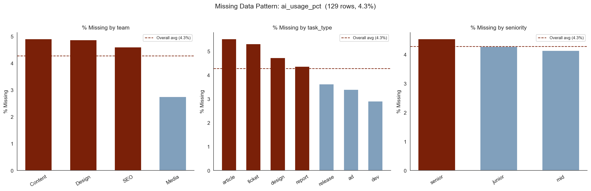

# AI Productivity: Does AI Help or Hurt the Business?

**Team Members:**: [Alexandra Tabarani]·[Gabriele Loreti]·[Edoardo Cocciò]

### Project Structure

```
├── main.ipynb                          # Main notebook: EDA + Modelling
├── scripts/
│   └── preprocess.py                   # Data loading and cleaning pipeline
├── data/
│   └── ai_productivity_dataset_final.csv
├── images/                             # All charts generated by the notebook
├── pyproject.toml
└── uv.lock
```

The project runs as a single Jupyter notebook (`main.ipynb`) covering the full pipeline: data cleaning, exploratory analysis, OLS inference, regularised models, Random Forest, XGBoost, and SHAP interpretability. The `scripts/preprocess.py` module handles all loading and cleaning steps so the notebook stays focused on analysis.

### Setup & Running

The project uses [uv](https://github.com/astral-sh/uv) for dependency management. To install and run:

```bash
uv sync
uv run jupyter notebook main.ipynb
```

All dependencies are declared in `pyproject.toml` and pinned in `uv.lock`.


## [Section 1] Introduction

Generative AI tools promise to make knowledge workers faster, but faster does not always mean more profitable. When a consultant uses AI to draft a report in two hours instead of six, who captures the gain: the agency, or the client? Does the time saved translate into higher margins, or does it get absorbed by rework, lower billing rates, or pricing models that were never designed for AI-assisted delivery?

This project investigates those questions empirically using a dataset of **3,248 professional service tasks** drawn from a real agency operation spanning Content, Design, SEO, and Media delivery teams. Each row represents one completed or in-progress task - article, design asset, development ticket, report, and so on - and records how much AI was used, how long it took, what it cost, what it billed, and whether the outcome met quality and deadline standards.

The **primary research question** is:

> At what level of AI usage does AI assistance start compressing profit margins, and what moderating factors explain when AI helps versus hurts?

Secondary questions include:

- Does AI usage reduce SLA breach rates or introduce new delivery risk?
- Does higher AI usage reduce perceived quality?
- How does the pricing model mediate the relationship between AI and profit?
- Do senior contributors extract more or less value from AI than junior ones?
- Do scope changes compound or dampen the effect of AI on rework and cost?

The analysis moves through three stages: **exploratory data analysis (EDA)**, **baseline statistical modelling**, and **machine learning with interpretability techniques**. The goal is actionable findings for business stakeholders — not just statistical significance, but concrete guidance on where AI deployment is profitable and where it is not.


## [Section 2] Methods

### 2.1 Dataset

The dataset contains **3,248 tasks** drawn from a professional services operation. Each row represents one completed or in-progress deliverable. The key columns used throughout the analysis are listed below.


| Column | Type | Description |
|---|---|---|
| `task_id` | string | Unique task identifier |
| `client` | string | Client name |
| `project_id` | string | Project identifier |
| `client_tier` | categorical | Client tier classification |
| `team` | categorical | Delivery team (Content, Media, SEO, Design) |
| `task_type` | categorical | Task category (article, design, ticket, report, ad, dev, release) |
| `seniority` | categorical | Contributor seniority (junior, mid, senior) |
| `task_complexity_score` | numeric | Internal complexity rating |
| `brief_quality_score` | numeric | Quality score of the task brief |
| `deadline_pressure` | numeric | Measure of deadline urgency |
| `scope_change_flag` | binary | 1 if the task scope changed after kick-off |
| `pricing_model` | categorical | Pricing structure (fixed, hourly, value_based) |
| `created_at` | datetime | Task creation timestamp |
| `delivered_at` | datetime | Task delivery timestamp |
| `sla_days` | numeric | Number of days allowed by the SLA |
| `sla_breach` | binary | 1 if SLA was breached, 0 otherwise |
| `hours_spent` | numeric | Total hours spent on the task |
| `billable_hours` | numeric | Hours billed to the client |
| `ai_usage_pct` | numeric | Share of work performed with AI assistance (0–100%) |
| `ai_assisted` | boolean | Redundant binary flag ; dropped in favour of `ai_usage_pct` |
| `revisions` | numeric | Number of revisions requested |
| `errors` | numeric | Count of errors recorded during delivery |
| `rework_hours` | numeric | Hours spent on rework |
| `outcome_score` | numeric | Internal quality / outcome assessment (0–100) |
| `revenue` | numeric | Revenue billed for the task (€) |
| `cost` | numeric | Cost of delivery (€) |
| `profit` | numeric | Revenue minus cost (€); can be negative |
| `created_by` | string | User who created the task record |
| `updated_at` | datetime | Timestamp of last record update |
| `task_status` | categorical | Current task status |
| `workflow_stage` | categorical | Stage in the delivery workflow |
| `jira_ticket` | string | Associated Jira ticket reference |
| `legacy_ai_flag` | boolean | Legacy AI flag (unreliable; 339 "unknown" entries) |
| `content_version` | string | Content version identifier |


---

### 2.2 Data Cleaning

The raw dataset required several cleaning steps before any analysis could be trusted. Each issue was inspected individually, its root cause reasoned through, and a resolution applied immediately. The goal was to remove only what was genuinely uninterpretable while preserving every row that carries legitimate business signal — including unprofitable tasks and future-dated scheduled work.

The dataset started at **3,248 rows** and settled at **3,016 rows** after cleaning.


#### Negative `billable_hours`

Seventeen rows had negative values for `billable_hours`, ranging from −0.28 h to −1.90 h. Negative hours billed are not physically possible. Inspecting the affected rows showed that the tasks remained profitable, which points to billing corrections or inter-project hour transfers rather than data entry errors. Because negative hours carry no meaningful interpretation, the values were capped at zero. No rows were removed.

#### Negative `profit`

Eight hundred and seventeen tasks (25% of the dataset) recorded negative profit, with losses ranging from −€1.60 to −€8,510. Unlike negative billable hours, negative profit is a valid and highly informative business outcome. These are exactly the rows that matter most for understanding when AI fails to generate margin. They were not removed. A binary column `is_loss` was added to make loss status directly usable as a feature or target variable in modelling.

#### `rework_hours` Greater Than `hours_spent`

Since rework is performed within the total time a task takes, `rework_hours` cannot logically exceed `hours_spent`. Sixty-seven rows violated this constraint. No plausible business explanation exists for this pattern, so the rows were treated as data entry errors and dropped.

#### Conflict Between `ai_assisted` and `ai_usage_pct`

The dataset contained two AI usage columns: a boolean `ai_assisted` flag and a continuous `ai_usage_pct` percentage. A number of rows showed the two columns in direct contradiction, with tasks marked as not AI-assisted despite recording non-zero usage percentages, and vice versa. Because `ai_usage_pct` is a continuous measure that directly captures the share of work done with AI, it is strictly more informative than a binary flag. The inconsistencies are consistent with `ai_assisted` being an unreliable derived field rather than a source of truth. The `ai_assisted` column was dropped in favour of `ai_usage_pct` throughout the analysis.

---

### Categorical Normalisation


The raw `team` column recorded 15 distinct values despite the organisation having only 4 real teams: Content, Media, SEO, and Design. The extra values were entirely the result of casing variants and typos. A standardisation mapping was applied and the column collapsed to 4 clean values.

The raw `task_type` column recorded 29 distinct values despite the operation having only 7 real task types: article, design, ticket, report, ad, dev, and release. Issues included inconsistent casing, a spurious `_task` suffix on many entries, outright typos (`artcle`, `repport`, `relese`), and aliased names where the same concept appeared under multiple labels (`blog_article` and `blog` both mapped to `article`; `paid_ad` and `ad` collapsed to `ad`; `support_ticket` to `ticket`; `development` and `dev` to `dev`; `creative` to `design`). A consolidation function was applied and the column collapsed to 7 clean values.

#### `legacy_ai_flag`

This column was declared as boolean but contained a third value, `"unknown"`, in 332 rows. The `"unknown"` entries were replaced with `NaN` so they are handled consistently with other missing values rather than masquerading as a meaningful category. The remaining `"true"` and `"false"` strings were converted to proper booleans.

---

#### Duplicate Records

Forty-five `task_id` values appeared twice in the dataset, producing 90 rows for 45 tasks. The most plausible explanation is that tasks were updated after initial entry and both versions were exported. The most recent record per `task_id` (determined by `updated_at`) was kept and the older version was dropped.

---

#### Date Validation

Delivery timestamps were parsed to datetime and validated against creation timestamps. Eleven rows recorded a `delivered_at` date earlier than `created_at`, which is logically impossible. These rows were removed.

Five hundred and five tasks had a `created_at` date in the future relative to the data export cutoff. These were retained. Their financial and AI usage fields are fully populated, they represent legitimately scheduled work, and removing them would silently discard valid data.


---

### 2.3 Feature Engineering

**AI Band (`ai_band`):** For grouped visualisation and analysis, `ai_usage_pct` is segmented into three bands used consistently throughout:

| Band | Range |
|---|---|
| `low` | 0 – 25% |
| `medium` | 25 – 50% |
| `high` | > 50% |

Where finer resolution is needed, the continuous variable is cut into **decile bins**. A consistent colour palette is applied throughout so the same band always maps to the same colour across all charts.

**Loss flag (`is_loss`):** A binary column derived from `profit < 0`, used as a classification target in the modelling stage.

---

## [Section 3] Experimental Design


...


## [Section 4] Results

### Exploratory Data Analysis

All visualisations use a shared three-level categorical variable `ai_band` derived from `ai_usage_pct`:

* **low** ; 0 to 25% AI usage
* **medium** ; 25 to 50% AI usage
* **high** ; above 50% AI usage

Where finer resolution is needed, the continuous variable is cut into decile bins. A consistent colour palette is applied throughout so that the same AI band always maps to the same colour across all charts.

---

### 1. Distributions of Core Variables


A 2×3 grid of histograms shows the marginal distribution of the six most important variables before any grouping: `ai_usage_pct`, `profit`, `hours_spent`, `rework_hours`, `errors`, and `outcome_score`.

The initial distribution analysis of the six core variables highlights a dataset defined by extreme variance and structural complexity. Most critically, **hours_spent** and **profit** exhibit severe right-skewness, with hours_spent (skew 10.18) showing a massive disconnect between the 11.16-hour median and "marathon" tasks exceeding 250 hours, while profit reveals a volatile landscape of "black swan" losses exceeding €8,000. Similarly, **rework_hours** and **errors** follow this right-skewed pattern, with a median of 1.78 hours and 1.00 error respectively, confirming that while the majority of tasks are high-efficiency, the outliers represent qualitatively different work that could distort standard regression models. In contrast, **ai_usage_pct** shows a broad, healthy distribution across the 0% to 80% range, suggesting a normalized adoption of AI tools across the board. The **outcome_score** remains the only near-symmetric variable (skew -0.29), implying that while AI usage and time-intensity vary wildly, average quality remains remarkably stable at a median of 69; this suggests the true narrative of the data lies in the volatile tails of efficiency and cost rather than in shifting the mean performance.

---

### 2. AI Usage vs. Outcomes: Decile Means


Five line plots, each showing a mean outcome variable across AI usage deciles with 95% confidence intervals. The five outcomes are `profit`, `hours_spent`, `rework_hours`, `outcome_score`, and `errors`.

While **profit** nearly doubles—climbing from approximately €225 in the lowest decile to a peak of €514-the drivers of this growth are complex. A clear efficiency gain is evident as **hours_spent** drops from peak levels toward 11 hours per task; however, this speed-up coincides with a steady rise in **rework_hours** and a moderate increase in **errors**, suggesting that high-intensity AI adoption may be trading off accuracy for velocity. 

Most notably, the **outcome_score** remains remarkably flat for the majority of the distribution before exhibiting a visible decline after the 60% and 70% decile midpoints. This downward turn, coupled with rising rework, suggests a potential "diminishing returns" threshold where excessive AI reliance begins to erode quality. While the **95% confidence intervals** widen at these higher deciles due to smaller sample sizes, the simultaneous drop in score and rise in rework signals that the operational risks of "over-reliance" warrant cautious management to prevent efficiency gains from compromising the final deliverable.

---

### 3. Outcome Distributions by AI Band


The grouped analysis by AI usage bands confirms that higher AI integration correlates with superior financial and delivery performance, though not without secondary operational costs. Most notably, the **high (50%+)** band demonstrates a clear shift toward higher profitability and lower **hours_spent**, with the median time per task dropping visibly compared to the **low** band. This efficiency is further validated by the **SLA Breach Rate** and **Loss Rate** charts, which show significant improvements as AI usage increases - SLA breaches drop from 44.3% to 31.9%, and loss rates fall from 31.3% to 19.7%. These trends strongly suggest that AI is being used effectively to meet deadlines and secure project viability, effectively debunking the idea that more AI leads to higher project failure rates.

However, the discrete count and rework visualizations highlight the "hidden tax" of this increased velocity. As AI usage climbs, both **mean errors** and **mean revisions** trend upward, alongside a tightening but higher-reaching distribution in **rework_hours**. This indicates that while the overall project timeline is shorter, the delivery process becomes more iterative, requiring more frequent corrections to maintain quality. Interestingly, the **outcome_score** remains remarkably consistent across all bands, with the median holding steady near 70; this reinforces the conclusion that AI is primarily a tool for optimizing "how" work is produced-improving speed and margins—rather than fundamentally changing the "what" in terms of final quality assessments.

---

### 4. Speed–Quality Trade-off


Three line plots indexed to the low AI band (set to 100), showing how `hours_spent`, `rework_hours`, and `outcome_score` evolve as AI usage increases. Indexing removes the unit differences and makes the relative magnitudes directly comparable.

The chart makes the trade-off concrete and quantified. Hours fall to roughly 85 of baseline (a saving of about 2 hours per task). Rework rises to roughly 145 of baseline (an addition of about 0.9 hours). The net efficiency gain is therefore approximately 1.1 hours per task. Outcome score stays between 98 and 101 throughout ; effectively flat. The implication is that AI buys real time, costs some rework, and does not change average quality. What the average hides ; that the quality floor erodes in the high AI tail ; is explored in later plots.

---

### 5. Segmentation by Task Type and Team


Two grouped bar charts with 95% confidence intervals illustrate mean profit by `task_type` in the left panel and by `team` in the right panel, both categorized by AI usage bands. The analysis demonstrates that not all task types respond to AI equally; specifically, **release** tasks show the strongest and most statistically reliable AI dividend, with profit rising significantly across bands ($p = 0.018$). In contrast, **article** and **ad** tasks exhibit an inverted-U pattern peaking in the medium band and falling at high AI usage which suggests that over-automation in content-heavy work introduces enough rework to erode initial gains. While **design**, **dev**, **report**, and **ticket** tasks show profit increases at high AI levels, their wider confidence intervals indicate significant outcome volatility. At the team level, **SEO** captures the largest absolute benefit from AI, with **Media** and **Design** also seeing improvements, whereas the **Content** team experiences a distinct profit decrease at the highest AI usage levels.

In conclusion, these results suggest that while AI effectively multiplies value for structured and technical workflows, it hits a performance ceiling in creative domains where human oversight is necessary to prevent diminishing returns.

---

### 6. Segmentation by Seniority, Complexity, and Deadline Pressure


Three grouped bar charts breaking down mean profit by `seniority`, `task_complexity_score` (binned), and `deadline_pressure` (binned), each grouped by AI band.

The seniority analysis reveals a notable divergence in how different experience levels leverage AI. Junior contributors reach a performance ceiling in the medium AI band (€568) and see profits decreases at high usage (€525), suggesting they may struggle to direct high levels of automation productively. In contrast, senior contributors achieve their highest profit at high AI usage, though they carry a much higher financial risk when tasks fail due to their expensive billing rates.

Task complexity shows a definitive "sweet spot" for AI integration in the middle of the scale. High AI usage is not beneficial for the simplest tasks (score 1) or the most difficult tasks (score 5), where profit actually dips compared to the medium band. This indicates that while AI excels at optimizing mid-level, structured work, it likely adds unnecessary overhead to very simple tasks and cannot yet replace human expertise for genuinely novel, high-complexity problems.

Deadline pressure acts as a major catalyst for AI-driven profitability, with margins scaling consistently as usage increases across all pressure levels. The absolute gains are most significant during high-pressure scenarios, where AI functions as a vital efficiency multiplier. This allows teams to protect and even grow their profit margins during urgent delivery windows when manual work would typically become too slow or costly to remain viable.

---

### 7. Seniority × Pricing Model: Profit Heatmap


A 3×3 heatmap showing mean profit for every combination of `seniority` (junior, mid, senior) and `pricing_model` (fixed, hourly, value-based). 

The most striking finding is that senior contributors on hourly contracts record the worst mean profit and the highest loss rate of any segment, actually resulting in a negative mean of **-€77**. However, senior profitability improves significantly on fixed contracts and reaches its peak on value-based models at **€511**. This confirms that the pricing model is not a passive backdrop; it determines whether AI-driven productivity gains accrue to the agency or the client. On hourly contracts, every hour saved by AI is an hour not billed, causing efficiency gains to vanish from the revenue line, whereas on fixed or value-based contracts, those saved hours become margin.

Junior contributors on value-based contracts represent the most profitable profile in the matrix at **€923** per task. This segment remains the most resilient because the value-based fee does not compress when AI accelerates delivery speeds. Juniors on value-based contracts represent the highest-profit segment in the entire matrix, as their lower cost base maximizes the spread between the fixed fee and the reduced hours spent.

---

### 8. Correlation Heatmap


A lower-triangle heatmap of pairwise Pearson correlations between the eleven continuous variables most relevant to the analysis: `ai_usage_pct`, `profit`, `hours_spent`, `billable_hours`, `rework_hours`, `revisions`, `errors`, `outcome_score`, `sla_breach`, `task_complexity_score`, and `brief_quality_score`.

The correlation matrix identifies a significant operational trade-off where **ai_usage_pct** acts as a driver for both financial gain and process friction. While higher AI integration is linked to improved **profit (0.11)** and a reduction in **sla_breach (-0.11)**, it simultaneously correlates with an increase in **rework_hours (0.17)** and is more frequently utilized for high-complexity tasks. This "quality tax" is further evidenced by the strong negative impact that **errors (-0.48)** and **rework_hours (-0.26)** have on the final **outcome_score**. Conversely, the data highlights that **brief_quality_score** is a critical safeguard; a high-quality brief is the strongest positive predictor of the **outcome_score (0.34)** and serves as a vital defense against excessive **rework_hours (-0.36)**. Ultimately, the matrix suggests that while AI successfully accelerates delivery and protects margins, the final quality of the work remains heavily dependent on the clarity of the initial instructions and the effective management of the resulting iterative corrections.

---

### 9. Impact of Scope Changes Across AI Usage Bands


Four grouped bar charts comparing `profit`, `hours_spent`, `rework_hours`, and `sla_breach` for tasks with and without scope changes, broken out by AI band. The 14% of tasks that experienced a scope change after kick-off are shown alongside the 86% that did not.

The data indicates that high AI usage acts as a critical stabilizer against the traditionally negative impacts of scope creep. While scope changes typically erode margins and increase deadline risk in low-automation workflows, the **high (50%+)** AI band shows a unique reversal where tasks with expanded scopes actually achieve the highest overall profitability and a significantly lower **SLA Breach Rate**. This resilience suggests that AI provides the "burst capacity" necessary to absorb additional requirements without missing deadlines, effectively transforming scope changes from an operational threat into a high-margin opportunity. However, this financial recovery does not eliminate process friction, as **rework_hours** remain consistently elevated whenever scope shifts, confirming that while AI can protect the bottom line and the schedule, it still requires a high volume of iterative corrections to navigate changing project requirements.

---

### Missing Data Importance Analysis



An examination of the missingness within the **ai_usage_pct** variable was conducted to determine if specific gaps in reporting might skew the overall importance of the dataset. Despite the initial focus, the results show that nothing especially significant emerges from the patterns, as the vast majority of categories hover very close to the 4.3% baseline. While there are minor elevations in missingness for senior staff and the Content team, these deviations are small enough that they do not suggest a systematic failure in data collection or a major hidden bias. For the most part, the missingness appears relatively distributed across the board, indicating that the impact of these 129 missing rows on the final analysis is likely negligible.


---

### 10. The Rework Threshold: Where Speed Gains Are Eroded


The chart highlights a definitive productivity threshold around the **50–60%** AI usage mark, where a consistent decline in **hours spent** begins to outweigh the rising "rework tax." While **rework hours** trend upward as AI integration increases—reflecting a higher volume of necessary corrections—the **net hours** trend sharply downward, proving that the speed gains from AI are substantial enough to offset the added friction of iterative edits. However, the data reveals a significant drop in sample size at the highest levels of automation, with only **3 tasks** recorded in the **90–100%** band compared to over **500** in the **20–30%** band. This indicates that while extreme AI usage appears to offer the most "clean" efficiency gains, it currently represents a very small, specialized fraction of the total workflow, whereas the most reliable efficiency gains are currently captured in the high-volume **60–80%** usage range.

Main Finding: High AI usage serves as a powerful efficiency multiplier by driving a consistent decrease in net labor hours, though these gains are partially offset by a rising rework tax and occur across a significantly smaller volume of tasks as automation reaches its extreme.


The chart visualizes the "Value of AI" by measuring speed gains against extra rework relative to the manual baseline, revealing that AI integration only becomes a net positive after passing a significant usage threshold. In the **10% to 50%** range, AI usage is actually counterproductive, as the negative speed gains and increasing rework result in a consistent net loss of time. A critical "break-even" point occurs at the *60–70%** mark, after which the speed gains (blue bars) finally begin to outpace the extra rework (red bars), leading to a positive net gain that peaks dramatically in the high-usage bands. Specifically, the **60–70%** and **90–100%** bands show the most substantial value, suggesting that while moderate AI usage introduces friction without enough speed to compensate, high-intensity integration effectively overcomes the "rework tax" to deliver significant operational time savings.


From a business perspective, these findings highlight a clear "all-or-nothing" reality for AI integration, where the primary objective is to push through the initial friction to reach high-intensity usage:

* **The "Unprofitable Middle" Risk:** There is a dangerous "incompetence zone" between **10% and 50%** AI usage where the technology actively loses the business time. In this range, AI introduces enough errors and rework to outweigh any minor speed gains, meaning half-hearted or unguided adoption is a net drain on operational capacity.

* **Threshold for ROI:** Real return on investment (ROI) only begins to manifest once teams cross the **60–70%** usage threshold. Business leaders should treat this as a "productivity break-even point"; any workflow that cannot be automated at or above this level likely isn't yielding a positive time-saving dividend.

* **The Speed-to-Rework Trade-off:** The data confirms that AI does not produce "cleaner" work—it produces "faster" work that requires more correction. However, at high usage levels, the speed advantage is so overwhelming (saving up to **5 hours** per task in the extreme) that the business can easily absorb the increased rework and still come out significantly ahead on net labor costs.

* **Scalability of High-Intensity Workflows:** The most reliable "sweet spot" for scalable gains is the **60–80%** usage range. While the extreme **90%–100%** band shows the highest theoretical profit, the small sample size suggests it is difficult to replicate across the entire organization, whereas the **60%–80%** band provides a stable, high-margin efficiency gain.

* **Strategic Resource Allocation:** Because net hours decrease significantly at high usage levels, AI acts as a "burst capacity" tool. It allows the business to handle a higher volume of tasks (especially under deadline pressure or scope changes) with the same headcount, provided the pricing model is fixed or value-based to capture that efficiency as margin rather than passing it to the client as unbilled time.

---

### 11. Pricing Model Sustainability Under High AI Usage


The relationship between pricing models and AI integration reveals that hourly billing acts as a financial bottleneck, whereas value-based and fixed-fee structures allow the agency to capture the full benefit of automation. Under hourly contracts, mean profit remains stagnant and significantly lower than other models because every hour saved by AI directly reduces billable revenue, effectively transferring the productivity gain to the client. In contrast, value-based pricing consistently delivers the highest profit margins by decoupling earnings from labor time, though a slight decrease is visible at the extreme **90–100%** band—an effect that remains statistically inconclusive due to the scarcity of observations in that range. Fixed-fee models show a particularly dramatic breakout at these highest automation levels, where near-zero labor costs transform the bulk of the contract value into margin. However, the extreme volatility indicated by wide confidence intervals at high usage suggests that while the profit potential is vast, it carries a heightened risk of rework or quality failures that must be managed to protect those gains.


The analysis of loss rates confirms that the pricing model is a primary determinant of financial risk, with hourly billing serving as the most vulnerable structure regardless of automation intensity. Hourly contracts consistently yield the highest risk of loss, peaking near **38%**, which suggests that selling time offers no protection against the operational friction of rework or complexity. In contrast, value-based pricing provides the most stable defense at lower AI levels, while fixed-fee models show significant volatility before stabilizing at higher usage. Crucially, as AI integration increases across all three models, there is a nearly universal decrease in the loss rate; by the time usage moves into the **70-90%** range, the risk for both value-based and fixed models plummets toward zero. This demonstrates that high-intensity AI usage creates a sufficient efficiency cushion to effectively de-risk projects and insulate the agency from the financial impact of iterative corrections.

---

### 12. Speed vs. Quality: A Deeper Look


The data reveals a non-linear relationship between AI integration and delivery speed, characterized by an initial "integration hump" where low-to-moderate usage actually increases labor time. Between **10% and 30%** AI usage, mean hours spent peak at **14.2 hours**, suggesting that shallow adoption adds more overhead in experimentation and oversight than it saves in execution. However, a definitive efficiency pivot occurs once the **50% threshold** is crossed; beyond this point, hours spent trend downward, reaching a stable high-performance zone between **60% and 80%**. While the **90–100%** band delivers the fastest results at just **7.7 hours**, the broader trend confirms that the most significant business value is captured not by dabbling in AI, but by pushing through the initial friction to reach high-intensity usage where automation finally overcomes the human-in-the-loop overhead.


The quality stability analysis reveals that the average outcome score remains remarkably resilient at approximately **70%**, proving that increasing AI integration does not inherently degrade the standard of work. While a slight quality dip and increased volatility occur in the **70–90%** "stress zone" - where the **10th percentile** hits its lowest point - the apparent recovery in the final **90–100%** band should be viewed with caution. As with previous metrics, this extreme band contains only a few observations, making the perceived quality stabilization in near-total automation statistically inconclusive compared to the high-volume mid-range bands. Consequently, the data suggests that while the average stays stable, human oversight remains most critical as usage approaches the 90% threshold to prevent inconsistent results.


This chart reveals a fundamental "Profitability Paradox" where increasing technical friction, in the form of a rising rework ratio, directly correlates with a sharp decline in financial risk. As AI usage climbs, the loss rate drops from over **30%** to a mere **15%** in the high-intensity bands, even as rework peaks at roughly **32%**. This suggests that the speed gains provided by AI create an "efficiency cushion" large enough to absorb the cost of multiple iterations, effectively de-risking the business by allowing for a "fail-fast" workflow that remains profitable. The critical intersection between **50% and 60%** usage marks a strategic pivot point where the business moves from a high-loss environment to a high-rework, low-risk model. Crucially, the data confirms that the decrease in the loss rate is much more significant than the increase in rework friction, meaning the massive speed gains are not merely offset but serve to amplify the net gain. From a business standpoint, the clear suggestion is to abandon the traditional pursuit of "first-time accuracy" in favor of high-intensity AI adoption; by leaning into a model that prioritizes rapid generation followed by heavy iteration, the agency can capture significant margins, as the speed dividend far outweighs the "tax" of iterative corrections.

---

### 13. The AI Tipping Point Dashboard


A single dashboard normalises five metrics to zero at the manual baseline (0–10% AI) and plots them together across deciles: mean profit, mean hours, mean outcome score, rework ratio, and loss rate. Metrics with opposite interpretations are sign-adjusted so that upward movement always represents improvement.

The Dashboard serves as the definitive confirmation of a high-stakes "all-in" strategy, where the transition from operational degradation to exponential business improvement occurs only after crossing the **50% usage threshold**. Beyond this tipping point, **Mean Profit** and **Loss Rate** improvement soar—reaching gains of over **150%** relative to the baseline—while the **Quality Score** remains remarkably stable, proving that massive financial dividends do not require a sacrifice in output standards. Although the **Rework Ratio** trends deeply into the degradation zone, confirming a significant increase in iterative friction, the dashboard visually demonstrates that this "rework tax" is a minor trade-off for the radical expansion of margins and the near-elimination of financial risk. Ultimately, the data illustrates that moderate AI adoption is an unprofitable middle ground, and true competitive advantage is captured only in the **60–100% range**, where the speed and profit dividends finally overwhelm the inherent technical messiness of automation.

---

### 14. Seniority × AI Usage: Three Lenses


Three heatmaps cross seniority (junior, mid, senior) against AI usage in five bands and colour-code mean profit, loss rate, and mean rework hours respectively. Together they provide a complete risk-return picture for every seniority-AI combination.

The three heatmaps collectively reveal that high-intensity AI usage acts as a powerful "seniority equalizer" and a massive profit driver, particularly when expert knowledge is applied at the highest automation levels. While seniors face the highest financial risk at low AI usage with a **51%** loss rate, pushing into the **80–100%** band allows them to leverage their expertise to reduce rework friction and unlock a staggering **€3,935** mean profit - far outpacing any other group. Juniors, conversely, provide the most consistent baseline safety with the lowest loss rates across all bands, thanks to their lower cost structure. Ultimately, the data demonstrates that while heavy automation increases the "rework tax" for everyone, senior-level experts are uniquely capable of suppressing that friction at the highest usage levels, transforming AI from a mere tool into a high-margin force multiplier that fundamentally de-risks the most expensive tier of the workforce.

---

### 15. Task Type AI Sensitivity and the AI Dividend


The comparison of profitability across task types reveals that high-intensity AI integration acts as a powerful margin multiplier for technical and structured workflows while facing diminishing returns in creative domains. The most profound transformation is seen in the **Release** category, where mean profit skyrockets from **€138** to **€816**, a nearly sixfold increase that underscores the massive efficiency gains available in deployment-related automation. Similarly, structured tasks like **Dev** and **Report** see their profits more than double, proving that AI excels at handling the boilerplate and data synthesis required for technical outputs. However, the **Article** category presents a notable exception, as it is the only area where high AI usage actually reduces profit, likely due to the heavy "rework tax" required to bring automated creative writing up to human standards. Ultimately, the data suggests that the business should aggressively prioritize high AI usage in technical and repetitive categories like Release, Dev, and Reporting to capture the greatest financial dividends, while maintaining a more balanced, human-centric approach to long-form creative content.

---

### 16. The Rework–Errors–Revisions Cascade


The "Normalised Cascade" reveals that high-intensity AI adoption is a fundamental trade-off, where the massive gains in speed and profit are "taxed" by a significant rise in process friction. As usage climbs into the **80–90%** range, the amount of time required for human refinement—the **rework hours**—surges by over **80%**, marking this as the peak stress point for the team. While the AI is incredibly fast at generating first drafts, it creates a "messy" middle phase where errors and revisions begin to pile up, requiring more intensive human oversight to maintain quality. Crucially, at the extreme **90–100%** usage level, the data suggests a potential breaking point where people stop checking the work as thoroughly, causing errors to skyrocket; however, because we have so few observations in this final band, this should be treated as a warning sign rather than a definitive rule. Ultimately, the business must accept that moving to an AI-first model means shifting from a "get it right the first time" approach to a "fix it fast" approach, where the efficiency dividend is so large that it easily covers the cost of this increased iteration.

---


### Brief Quality and AI Interaction Analysis


The interaction between Brief Quality and AI Band highlights that while AI can significantly drive profitability, it remains secondary to the quality of the initial brief when determining final project outcomes. High-quality briefs (Q3 and Q4) consistently secure the best Mean Outcome Scores (71–74) regardless of how much AI is utilized, effectively setting a high performance floor. Conversely, AI acts as a financial accelerator for lower-tier briefs, particularly in the Mid-Low (Q2) category where high AI usage yields the maximum profit of €571 despite mediocre qualitative scores. Ultimately, the data suggests that for the highest-tier briefs, there is a point of diminishing returns where increased AI usage no longer substantially improves profit or quality, reinforcing the idea that human-led precision is the most stable predictor of success.

---

## Key Findings from Exploratory Data Analysis

### Financial Outcomes: The Profitability Paradox

The financial signal is unambiguous but counterintuitive in its mechanism. Mean profit per task rises from **€232 in the low-AI band to €474 in the high-AI band**, a net gain of **€242 per task**. The driver is not faster delivery translating directly into more billable output. It is the suppression of worst-case outcomes. Loss rate falls from **31% to 19%** as AI usage increases, meaning roughly **12 out of every 100 tasks that would have bled money are now profitable**.

This is the **Profitability Paradox**: the business becomes financially safer by becoming operationally messier. AI generates enough speed margin that the business can absorb higher rework volumes without tipping into loss. The efficiency cushion is what prevents projects from collapsing, not first-pass perfection.

The relationship is also distinctly non-linear. Below 50% AI usage, profit gains are modest and barely separable from noise. Above 50%, profit improvement accelerates sharply. **The 50% mark is not a milestone. It is a phase change.** Below it, AI is a tool. Above it, AI becomes a business-model lever.

### Efficiency and the Rework Tax

The aggregate efficiency math is favorable but tightly bounded. AI saves **~2.0 hours per task** while introducing a **~0.9 hour rework tax**, yielding a **net efficiency gain of 1.1 hours per task**. Across 3,016 tasks, that is roughly **3,300 reclaimed hours**, material capacity, but only if it is captured commercially rather than absorbed back into the workflow.

The friction profile inverts at 60%. Below this threshold, rework is negligible. Above it, rework hours rise faster than execution hours fall, and errors, revisions, and rework move in lockstep, a clear operational cascade. The interpretation is uncomfortable: at high AI usage, contributors stop scrutinizing AI output and start pushing it through. The system is trading process cleanliness for financial safety, and the trade is profitable, but it requires explicit acknowledgment because the failure mode is silent.

### Quality and the Safety Net Failure

Average outcome score holds at **~69 across all AI bands**. Headline quality is stable. The tail tells a different story: the **10th percentile of outcome scores drops by 11 points at high AI usage**. Quality has not degraded on average. It has bifurcated. Most work is fine; the worst work is meaningfully worse.

The 90 to 100% band shows the most concerning pattern: rework hours actually fall while error counts rise sharply. This is the **Safety Net Failure**, the iterative correction loop that absorbs AI mistakes at moderate usage breaks down entirely at extreme usage. Errors stop being caught and start being shipped. This band contains only **3 tasks** in the cleaned dataset, so the finding is directional rather than conclusive, but the directional signal is exactly the kind of risk that justifies a control before the volume scales.

### Moderators: Pricing and Seniority

Pricing model is the single most consequential variable in the entire dataset, larger in effect than AI usage itself. On **hourly contracts, AI is a margin destroyer**: every saved hour is revenue removed from the invoice, and loss rates remain near 38% regardless of AI intensity. On **fixed and value-based contracts at high AI usage, profit climbs aggressively and loss rates approach zero**. The gap between the worst pricing model and the best at high AI usage is approximately **€1,200 per task**. This is not optimization. It is a structural feature of the contract architecture deciding who captures the AI dividend, the agency or the client.

Seniority interacts with this dynamic asymmetrically. **Senior contributors at low AI usage carry a 51% loss rate**, by far the worst risk profile in the workforce, because their billing rates do not justify manual execution. The same seniors at **80 to 100% AI usage on the right contract structure deliver a mean profit of €3,935 per task**, roughly 8x the dataset median. AI is no longer optional for seniors; it is the only configuration in which their cost base is commercially viable. Junior contributors show the inverse profile: lowest loss rates across the board, but their profit ceiling caps in the medium AI band (€568) and slightly declines at high usage (€525) because they hit a complexity ceiling AI cannot push them past without senior direction. **Mid-level contributors are the most stable operators**. They show consistent profit growth across all bands and the most reliable safety profile, making them the natural anchor for scaling AI workflows.


##  Modelling Results

...


## [Section 5] Conclusions (to be refined)


### What Business Data Is Missing?

The dataset captures operational and financial outcomes well. However, several variables that would sharpen the causal story and support actionable recommendations are not tracked. These are the highest-priority gaps:

| # | Missing Variable | Why It Matters |
|---|---|---|
| 1 | **Client satisfaction score (NPS/CSAT per deliverable)** | Outcome scores reflect internal quality assessment only. Client-reported satisfaction would reveal whether AI-generated work is accepted, revised, or churned ; the retention signal that actually drives long-run revenue. |
| 2 | **AI tool identity** (GPT-4, Claude, Midjourney, Copilot…) | Aggregating all usage into `ai_usage_pct` masks tool-level differences. A task at 80% AI with a code assistant is structurally different from one using an image generator ; cost basis, error profile, and rework risk are not comparable. |
| 3 | **Revision reason codes** (client request / quality failure / scope creep / internal QA) | `rework_hours` exists but not why rework happened. Without this, AI-induced quality failures are indistinguishable from client preference changes ; two very different remediation paths. |
| 4 | **Task re-assignment flag** | If a task changes hands mid-delivery, seniority attribution becomes ambiguous. Senior contributors may be cleaning up AI-generated work from juniors, distorting the observed seniority × profit signal. |
| 5 | **Actual invoiced amount vs. quoted amount** | Revenue is currently inferred from contract type and hours. Tracking the actual invoice would capture discounting, write-offs, and scope adjustments that compress margins silently ; particularly relevant on hourly contracts. |
| 6 | **QA / review hours tracked separately from rework** | `rework_hours` conflates first-pass internal review with post-delivery correction. Separating them would show whether AI increases review burden even when client-visible quality looks acceptable. |
| 7 | **AI prompt quality or iteration count** | High `ai_usage_pct` says nothing about how well AI was directed. Two precise prompts vs. thirty rejected iterations yield the same usage share but completely different efficiency and cost profiles ; a critical missing skill signal. |
| 8 | **Client renewal / churn signal (12-month horizon)** | The most consequential downstream effect of AI adoption ; whether clients return ; is entirely absent. A task that looks profitable today may have damaged a relationship worth multiples of that single margin. |

**Implication for modelling:** Variables 1, 3, and 8 would transform this from a cost-efficiency analysis into a full customer-lifetime-value model. Variables 2 and 7 would allow tool-level and skill-level decomposition of the AI effect ; the analysis stakeholders actually need to set tool procurement and training policy.

**A note on statistical coverage at extreme AI usage:** The 90–100% AI band contains only **3 tasks** in the cleaned dataset. Any conclusion drawn from this range is statistically unreliable. Deliberately collecting more tasks at this extreme would be the single highest-leverage data collection effort: it would either validate or invalidate the extrapolated trend and allow a true upper-bound threshold to be set with confidence.

---

This final report synthesizes the financial, operational, and qualitative signals identified throughout the analysis. It highlights the "Profitability Paradox" and the "Safety Net Failure" that occur at the extremes of automation.


---
# Strategic Business Recommendations

> The recommendations below are ordered by financial leverage and structured to act on what the data actually proves, not what is intuitively appealing. Each carries a quantified target drawn from EDA findings and validated by OLS regression, SHAP decomposition, and the classification model.

---

## Critical Priorities

### 1. Restructure the Pricing Book Before Scaling AI Further

The most expensive problem the data exposes is not technological — it is contractual. The OLS regression, holding every other variable constant (hours worked, seniority, complexity, task type, team), finds that:

- An **hourly contract** earns **€254 less per task** than an identical fixed-price task
- **Value-based pricing** earns **€286 more** than fixed
- This creates a **€540 structural spread** for the exact same work, determined entirely at the moment of contract signing

The interaction model makes this more damning. When AI usage is added as a moderator, the **hourly penalty compounds to −€701 per task** (p < 0.001). AI's standalone contribution to profit is +€222 at full adoption — but under hourly billing, that gain is completely destroyed and then reversed. The mechanism is mechanical: AI compresses hours, fewer hours are billed, revenue falls while costs do not, and the productivity dividend transfers to the client rather than the agency. The SHAP analysis confirms this at every level of AI usage — **there is no usage level at which hourly pricing becomes safe under AI-assisted delivery**.

The EDA quantifies the visible damage:

- **€1,200 per-task gap** between hourly and value-based contracts at high AI usage
- **34% loss rate** on hourly tasks vs. 16% on fixed and value-based
- Hourly pricing is the **single largest SHAP driver** of loss probability in the classifier
- Hourly contracts represent **46% of all tasks** — the highest-risk structure is also the most prevalent

**Action:** Migrate the AI-eligible portfolio off hourly contracts as the immediate priority. Senior-led engagements come first: the hourly model produces a mean profit of −€77 per task for seniors versus €511 on value-based — a swing of nearly **€600 per task** on the most expensive talent in the business. Reposition the standard commercial offer around fixed-fee deliverables and value-based outcomes. The pitch becomes *"guaranteed delivery, absorbed scope changes"* — a story the data supports directly, since high-AI tasks with scope changes outperform those without in terms of both profit and SLA compliance.

**Target outcome:** Recover the €540 OLS-estimated structural gap on every task migrated off hourly contracts. Eliminate the −€701 AI interaction penalty entirely by removing the contract structure that triggers it. Convert junior-plus-value-based work into an explicitly marketed delivery tier: at **€923 mean profit per task**, it is the single most profitable segment in the entire seniority-pricing matrix and currently has no commercial product built around it.

---

### 2. Establish the 30% AI Floor and the 60% Efficiency Threshold as Two Distinct Targets

There are two separate thresholds in the data, operating through different mechanisms — they are not the same number.

| Threshold | Mechanism | Effect |
|---|---|---|
| **30.6% (SHAP crossing point)** | AI's contribution to profit switches sign | Below: −€52.5/task avg. Above: +€51.1/task avg. Gap = ~€103/task |
| **60–70% (efficiency threshold)** | Speed gains from AI outpace the rework tax in net hours | Below 60%: hours *peak* at 14.2 hrs (above manual baseline). Above 60%: net hours trend into stable 60–80% zone |

These are two different problems requiring two different interventions:

- **1–30% AI usage** on fixed/value-based: AI is being used but costs more than it produces
- **30–60% AI usage**: crossed into positive contribution but not yet into net efficiency gain
- **Above 60%**: real ROI consolidates on both dimensions — profit and time

Both thresholds are **entirely irrelevant under hourly pricing**, where AI's SHAP is negative at every usage level.

**Action:** Treat AI adoption as binary at the workflow level. For each process: either re-architect it to operate above 60% AI usage, or leave it fully manual. The 10–50% range is measurably worse than either extreme. Establish **30% as the minimum floor** below which AI should not be used at all on fixed or value-based contracts.

**Target outcome:** Move at least **70% of eligible tasks into the 60–80% AI band** within two operating quarters. The combined effect of clearing both thresholds delivers the full **€242 per-task profit lift** documented in the EDA, applied to the migrated volume.

---

## High Priority

### 3. Differentiate AI Strategy by Task Type

AI is not uniformly profitable across deliverables:

| Task Type | Profit at Low AI | Profit at High AI | Multiplier | Direction |
|---|---|---|---|---|
| **Release** | €138 | €816 | 5.9× | Push to 70–80% |
| **Dev** | — | — | 2×+ | Push to 70–80% |
| **Report** | — | — | 2×+ | Push to 70–80% |
| **Article** | — | Peaks at medium, then declines | — | Cap at 25–50% |

The OLS confirms this structure — task type dummies for report (+€205), dev (+€191), and article (+€153) are all significant relative to the ad baseline, but the direction of AI's interaction with task type differs by category. Articles invert because rework outpaces speed gains in creative, judgment-heavy work.

**Action:** Aggressively push Release, Dev, and Report toward 70–80% AI usage with refined templates, automated QA, and task-specific prompt libraries. Cap Article and Ad workflows at the medium band (25–50%) and reposition the Content team's AI usage as a drafting tool rather than a production tool.

**Target outcome:** Capture the **+€678 per-task dividend** in Release tasks specifically, and avoid the negative dividend in long-form content.

---

### 4. Target High-Tier Clients and Complex Work as the Natural Habitat for AI Delivery

The OLS finds two consistent, significant, independent effects after controlling for everything else:

- Each step of **client tier** adds **+€114 to profit** (p < 0.01)
- Each step of **task complexity** adds **+€111 to profit** (p < 0.01)

The classifier's decision table confirms this as loss *protection*, not just profit upside:

| Factor | Loss Rate | vs. Comparison | Reduction |
|---|---|---|---|
| High-tier clients | 16% | 27% (low/mid-tier) | −10pp |
| High-complexity tasks | 18% | 26% (low complexity) | −8pp |

The mechanism: premium clients and hard tasks are more likely to be on better contracts and billed at rates that justify the work required. Positioning AI as a commodity cost-reduction tool for undifferentiated clients is selling into the **worst-performing quadrant** of the data.

**Action:** Prioritise AI-assisted delivery on complex engagements with high-tier clients. In business development, position AI capability as a differentiator for demanding, high-margin work. The combination of **high client tier + high complexity + fixed or value-based contract** is where the three largest protective factors in the classifier align simultaneously.

**Target outcome:** Concentrate the AI-intensive workforce on the quadrant where loss rates fall below 18% and OLS coefficients of +€114 and +€111 apply per variable step.

---

### 5. Reposition Seniors as AI Force Multipliers, Not Manual Operators

Senior contributors are the **worst-performing segment at low AI usage** (51% loss rate) and the **best-performing at high AI usage** (€3,935 mean profit per task). The modelling explains both extremes:

- OLS baseline: each seniority level costs **−€173 in profit** all else equal (seniors are expensive, margin compresses by default)
- Interaction model: each seniority level raises the marginal return of AI by **+€359** (p = 0.002)
- At senior level (two steps above junior): the interaction gain (€718) fully reverses and more than doubles the cost drag (€346)

The SHAP waterfall for the worst predicted losses consistently shows the opposite configuration: **senior contributor + many hours + low-complexity task + moderate AI usage + non-value-based contract**. This is a resource allocation failure, not a bad task.

**Action:** Remove seniors from low-AI tactical execution. Any senior-led task should be pre-checked against two conditions before assignment:
1. AI usage target ≥ 60%
2. Contract type: fixed or value-based

If either fails, reassign or renegotiate before kickoff. Reallocate seniors toward 80–100% AI workflows on complex deliverables, AI workflow design, and prompt engineering for the wider team.

**Target outcome:** Shift the senior loss rate from **51% toward the mid-level baseline (21%)** while capturing the **€3,935 profit ceiling** on high-leverage engagements. This is the largest single talent-utilisation opportunity in the dataset.

---

### 6. Implement a Pre-Task Risk Score Using Six Variables

The classification model reaches **ROC-AUC = 0.754** and correctly identifies **55% of actual loss-making tasks before delivery**. With a precision of 43% on loss predictions, flagging 100 tasks as risky will correctly identify 43 genuine losses — and loss tasks run from −€1,209 to −€8,510.

The model reduces to **six variables** that together explain the loss structure:

| Variable | Safe Bucket Loss Rate | Risky Bucket Loss Rate | Gap | Risky Bucket Share |
|---|---|---|---|---|
| Hourly pricing | 16% | 34% | +18pp | 46% |
| Seniority (senior) | 21% | 33% | +12pp | 22% |
| Hours spent (long, top 25%) | 21% | 31% | +9pp | 25% |
| Client tier (high) | 27% | 16% | −10pp | 26% |
| Task complexity (high, top 25%) | 26% | 18% | −8pp | 30% |
| AI usage ≥ 30% | 28% | 21% | −8pp | 58% |

The three **risk factors** (hourly pricing, senior staffing, long hours) compound. The three **protective factors** (high client tier, high complexity, AI above threshold) compound in the other direction. No machine learning infrastructure is required — a lookup table suffices.

**Action:** Build a pre-task risk flag using these six variables. Any task that combines two or more risk factors should trigger a review of the contract structure, staffing assignment, or scope estimate **before kickoff**. The fix is upstream: once a task is underway, the structural disadvantages are locked in.

**Target outcome:** Intercept the highest-risk assignments before they are staffed. Redirecting even **20% of flagged senior-plus-hourly tasks** onto better contract structures would recover several hundred euros per task on a segment that currently loses money 34% of the time.

---

## Medium Priority

### 7. Fix Briefs Before Fixing Anything Else

Brief quality correlates:
- **+0.34** with outcome score
- **−0.36** with rework hours

These are the **strongest controllable predictors in the dataset** — larger than AI usage's own coefficients. High-quality briefs (Q3 to Q4) hold outcome scores at 71–74 regardless of AI band, effectively setting a performance floor that AI usage cannot shift.

The rework tax is not primarily an AI problem. It is a brief problem that AI amplifies by generating output faster than a poor brief can constrain it.

**Action:** Standardise a structured brief template across all teams. Score every brief before kickoff and refuse to start work below a defined quality threshold. This is process discipline with **zero tooling cost**.

**Target outcome:** Every additional point of brief quality reduces rework hours more than ten percentage points of additional AI usage. This is the **cheapest lever in the system**.

---

### 8. Reframe Rework — It Is a Time Cost, Not a Quality Signal

The cultural instinct treats rework as evidence of quality failure. The modelling disproves this via two explicit tests:

1. A **quadratic rework term** was added to the OLS to test whether rework destroys margin above some critical threshold: both terms returned p > 0.49 — non-significant. There is no rework tipping point.
2. An **AI × rework interaction** was added to test whether AI improves profit through a quality channel (less rework): coefficient = −92.7, p = 0.80 — completely insignificant.

AI does not act on profit through quality at all. Its entire profit effect runs through **hours** and how the contract treats those hours. Once hours spent is in the model, every quality variable — errors, revisions, rework ratio, outcome score — loses statistical significance entirely.

> The question is never *"is the quality good enough?"* but always *"how many hours did it take to get there?"*

The loss rate drops from 30%+ to ~15% across the AI usage range while rework rises — the trade is profitable.

**Action:** Replace first-pass quality KPIs with **iteration-speed KPIs**: cycle time, iterations-to-acceptance, defect-resolution time. Train team leads to push for fast generation followed by fast correction rather than slow careful drafting.

**Target outcome:** Sustain the loss-rate compression across the AI usage curve without organisational drift back toward *"get it right the first time"* — which the data shows is the more expensive strategy.

---

## Structural

### 9. Close the Three Data Blind Spots

The current dataset proves operational cost efficiency. It cannot prove customer value. Three additions would convert this from internal analytics into strategic intelligence:

**Client retention at 12 months** is the most consequential missing signal. A profitable task today that damages a multi-year relationship is a net loss the current data cannot detect.

**AI tool identity and prompt iteration count** would allow rational tool procurement and training investment. Two precise prompts and thirty rejected iterations look identical in `ai_usage_pct` today and are commercially incomparable.

**Revision reason codes** would separate AI-induced quality failures from client preference changes. The remediation paths are completely different and cannot be prioritised without the split.

---

#### A Specific Data Investment Worth Making

The **90–100% AI band contains only 3 tasks** in the cleaned dataset. Every extrapolation about extreme automation rests on three observations. The recommended action: deliberately commission **30–50 tasks in this band** across task types and seniority levels.

- If the upside holds at the extrapolated trajectory → the finding is worth millions in reallocation decisions
- If it exposes a breaking point → the finding prevents a costly misallocation

Either outcome is worth the cost of the experiment. This is the **single highest-leverage data collection effort** available.

---

## The Bottom Line

The data does not say *"AI improves margins."* It says something more precise and more useful:

> AI adds **+€222 per task** in profit under any contract, and destroys **−€701 per task** under hourly contracts. The net effect of aggressive AI adoption is therefore decided entirely by **one variable the sales team controls at the moment of signing**.

The technology is doing its job. **The business model is the bottleneck.** Every recommendation above is a different facet of the same instruction:

**Restructure the system around AI — instead of bolting AI onto the system that existed before it.**
