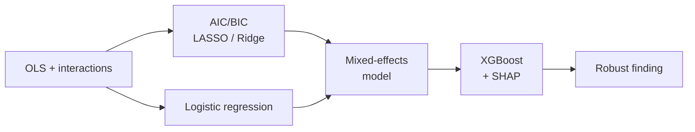
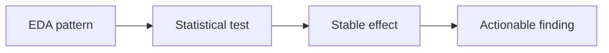

# AI Productivity Project

## Project Goal

The assignment is to explain when AI helps the business and when it stops creating value. The unit of analysis is one task or deliverable. 

The **main variable of interest** is `ai_usage_pct`, and the business target is `profit`, with `revenue` and `cost` as supporting outcomes. 

We also need to understand whether speed gains in `hours_spent` and `billable_hours` are later offset by `rework_hours`, `revisions`, `errors`, lower `outcome_score`, or `sla_breach`.

The goal is to find a mechanism such as: beyond a certain level of `ai_usage_pct`, rework or quality loss starts to compress margins.

## Dataset 

The dataset already gives us the main lenses we need:

| Variable | Type | Description |
| --- | --- | --- |
| `task_id` | Identifier | Unique task or deliverable ID. |
| `client` | Categorical | Client name or account linked to the task. |
| `project_id` | Identifier | Project-level identifier. |
| `client_tier` | Categorical | Commercial importance or tier of the client. |
| `team` | Categorical | Internal team responsible for delivery. |
| `task_type` | Categorical | Type of work performed. |
| `seniority` | Categorical | Seniority level of the main contributor. |
| `task_complexity_score` | Ordinal numeric | Score for task difficulty or complexity. |
| `brief_quality_score` | Ordinal numeric | Score for the quality or clarity of the initial brief. |
| `deadline_pressure` | Categorical | Intensity of deadline pressure. |
| `scope_change_flag` | Binary | Indicates whether task scope changed during execution. |
| `pricing_model` | Categorical | Commercial model, such as hourly or fixed. |
| `created_at` | Date | Task creation date. |
| `delivered_at` | Date | Task delivery date. |
| `sla_days` | Numeric | SLA target in days. |
| `sla_breach` | Binary | Indicates whether the SLA was breached. |
| `hours_spent` | Numeric | Total hours spent on the task. |
| `billable_hours` | Numeric | Hours that were billed to the client. |
| `ai_usage_pct` | Numeric | Share of the task completed with AI support. |
| `ai_assisted` | Binary | Indicates whether AI was used at all. |
| `revisions` | Count | Number of revision cycles. |
| `errors` | Count | Number of detected errors. |
| `rework_hours` | Numeric | Hours spent fixing or reworking the task. |
| `outcome_score` | Numeric | Overall outcome or quality score. |
| `revenue` | Numeric | Revenue generated by the task. |
| `cost` | Numeric | Cost incurred to complete the task. |
| `profit` | Numeric | Revenue minus cost. |
| `created_by` | Identifier | User who created the task record. |
| `updated_at` | Date | Last update date of the record. |
| `task_status` | Categorical | Current delivery status of the task. |
| `workflow_stage` | Categorical | Workflow stage reached by the task. |
| `jira_ticket` | Identifier | Linked ticket or workflow reference. |
| `legacy_ai_flag` | Binary | Indicates a legacy AI-related flag in the source system. |
| `content_version` | Categorical | Version label of the delivered content. |

### Missing Data and Questions to Raise

The PDF explicitly asks what is missing. We should call that out early.

## Questions to Answer

The analysis should stay anchored to a few business questions:

1. Where does higher `ai_usage_pct` reduce `hours_spent` or improve `profit`?
2. Where does AI improve speed but worsen `rework_hours`, `errors`, `revisions`, or `outcome_score`?
3. Is there a threshold where AI usage becomes harmful to margin?
4. Does the answer change by `task_type`, `team`, `seniority`, `task_complexity_score`, or `pricing_model`?
5. Is the hourly model less sustainable than fixed pricing when AI usage gets high?

## EDA and Visualization Plan
- Check missing values, duplicates, impossible values, and date consistency.
- Review the distribution of `ai_usage_pct`, `profit`, `rework_hours`, `hours_spent`, `errors`, and `outcome_score`.
- Plot `ai_usage_pct` against `profit`, `rework_hours`, `outcome_score`, `hours_spent`, and `errors`.
- Segment charts by `task_type`, `team`, `seniority`, `pricing_model`, `task_complexity_score`, and `deadline_pressure`.
- Compare low, medium, and high AI-usage bands to make threshold patterns easier to see.

Good first visuals:

- Histograms or KDE plots for core variables
- Scatterplots with trend lines
- Boxplots by AI-usage band
- Heatmaps or grouped bars for segment comparisons
- Time plots over `created_at` to detect drift

Each chart should answer a business question. If a chart does not help decide where value is created or lost, it is not important.

## Modeling Approach

Since this is exploratory and decision-oriented, **the default should be interpretable models**.

### 1. OLS with interaction terms

- Baseline regression for `profit` with the full set of controls.
- Interaction terms to test whether the effect of `ai_usage_pct` changes across subgroups:
  - `ai_usage_pct` x `task_complexity_score`
  - `ai_usage_pct` x `seniority`
  - `ai_usage_pct` x `pricing_model`
  - `ai_usage_pct` x `task_type`
- Report coefficients, confidence intervals, and effect sizes. Statistical significance alone is not enough — the effect needs to be business-relevant.

### 2. Model selection and regularization

- Use **AIC/BIC** to compare model specifications and avoid overfitting the interaction space.
- Use **LASSO** to let irrelevant interactions shrink to zero — keeps only the moderators that actually survive penalization.
- Use **Ridge** if multicollinearity is a concern, particularly between correlated task attributes.
- The goal is not prediction accuracy but a stable, parsimonious model that does not overfit the sample.

### 3. Logistic regression for risk outcomes

- Fit logistic regression for `sla_breach` and for the binary outcome `profit < 0`.
- Same interaction structure as the OLS model.
- Report odds ratios with CIs. Check calibration, not just accuracy.
- Use a shallow decision tree (depth 3–4) alongside logistic regression only to extract simple rules for presentation.

### 4. Mixed-effects model

- Tasks are nested within `client` and `project_id`. Ignoring this clustering understates standard errors and produces false significance.
- Add `client` or `team` as a random effect using `statsmodels.MixedLM`.
- Compare coefficients against the OLS baseline to see how much the clustering matters.

### 5. XGBoost with SHAP

- Not for the final deliverable, but as a diagnostic layer to validate patterns found in the interpretable models.
- SHAP dependence plots for `ai_usage_pct` show the marginal effect while controlling for all other variables — more honest than a scatter plot.
- SHAP interaction values confirm whether `ai_usage_pct × complexity` is a real interaction or noise.
- If SHAP and the OLS model agree, the finding is robust. If they disagree, investigate why before reporting.

The main modeling objective is explanation: when AI helps, when it hurts, and for whom.

## Statistical Validation

Statistical tests should validate the patterns found in EDA, not replace them.

- Use correlation tests for early signal checks.
- Compare low, medium, and high AI-usage groups on `profit`, `rework_hours`, and `outcome_score`.
- Use non-parametric tests if the distributions are skewed or heavy-tailed.
- Inspect coefficients, confidence intervals, and effect sizes in regression models.

What we want to validate:

- Is the speed gain statistically real?
- Is the quality or rework penalty statistically real?
- Is the threshold effect still visible after controlling for task context?
- Is the effect business-relevant, not just statistically significant?

